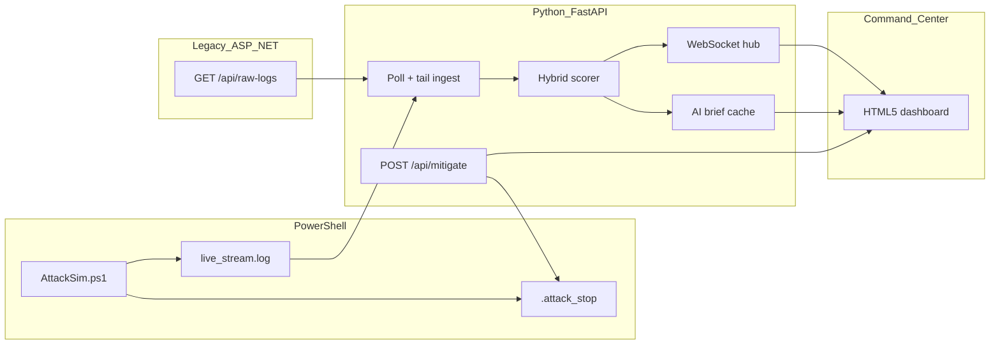

# Frankenstein Threat Command Center

**Project Frankenstein 2.0** — a demo that bridges legacy ASP.NET telemetry, a PowerShell attack simulator, and a Python analytics engine into a real-time **Threat Command Center** dashboard.

Challenge reference: [Joe-Juette/tc-Frankenstein](https://github.com/Joe-Juette/tc-Frankenstein)

## 30-second demo

```bash
chmod +x scripts/start-demo.sh
./scripts/start-demo.sh
```

Open [http://127.0.0.1:8000](http://127.0.0.1:8000). Watch the live feed and gauge climb as `AttackSim.ps1` runs. Click **MITIGATE ATTACK** to write a stop flag, halt the simulator, and decay the global threat score.

### Prerequisites

- [.NET 8 SDK](https://dotnet.microsoft.com/download)
- Python 3.11+
- [PowerShell (`pwsh`)](https://learn.microsoft.com/powershell/scripting/install/installing-powershell-on-macos) for the attack simulator

**Troubleshooting:** If you see `pydantic_core ... incompatible architecture (have 'arm64', need 'x86_64')`, your venv was built with a different CPU arch than the shell running the demo (often x86_64 PowerShell on Apple Silicon). Run `rm -rf bridge/.venv` and start again with `./scripts/start-demo.sh` (the script auto-recreates the venv). On Apple Silicon, running the demo from **Terminal.app** or **zsh** is the most reliable option.

Optional: copy `.env.example` to `.env` and set `OPENAI_API_KEY` for LLM-generated CISO briefs (template brief works without a key).

## Architecture



| Component | Stack | Port |
|-----------|-------|------|
| Legacy Logger | ASP.NET Minimal API | 5080 |
| Analytics Bridge | FastAPI + WebSocket | 8000 |
| Attack Simulator | PowerShell | writes `data/live_stream.log` |
| Command Center | HTML5 / CSS / JS | served by bridge at `/` |

## Unified event schema

| Field | Description |
|-------|-------------|
| `source` | `legacy` (C# API) or `live` (PowerShell log) |
| `event_type` | Attack or log event name |
| `origin` | IP or host identifier |
| `severity` | 1–10 |
| `status` | Legacy status when applicable (Failed/Denied boosts score) |

## Scoring rubric (deterministic)

- **Base:** attack-type weight × `(severity / 10)` × 100  
- **Legacy boost:** +15 when status is Failed, Denied, or Blocked  
- **Velocity:** up to +20 from events in the last 60 seconds  
- **Global score:** exponential moving average of per-event scores  
- **Levels:** `CRITICAL` if severity ≥ 8 or score ≥ 85; `HIGH` ≥ 65; `ELEVATED` ≥ 40  

Optional **LLM brief:** when `OPENAI_API_KEY` is set, the bridge generates a CISO-style narrative every ~25s during elevated activity. The gauge never depends on the LLM.

## Sales edge features

1. **AI Attack Brief** — executive narrative in the right panel (LLM or template).  
2. **Mitigate** — one-click stop via `data/.attack_stop` + visual neutralization and score decay.

## API

- `GET /api/state` — gauge and recent scored events  
- `GET /api/brief` — latest attack brief  
- `POST /api/mitigate` — halt attack sim and decay threat  
- `WS /ws/threats` — live event and state stream  

## Docker (optional)

```bash
docker compose up --build
```

## Development notes

Built with AI-assisted scaffolding (Cursor) for velocity; scoring weights, WebSocket contract, and demo orchestration were tuned for a reliable live interview demo.

## Publish to GitHub (submission)

From the project root after `git commit`:

```bash
gh repo create frankenstein-threat-command-center --public --source=. --remote=origin --push
```

Reply to the tech challenge intro email with the public repository URL.

## License

MIT
