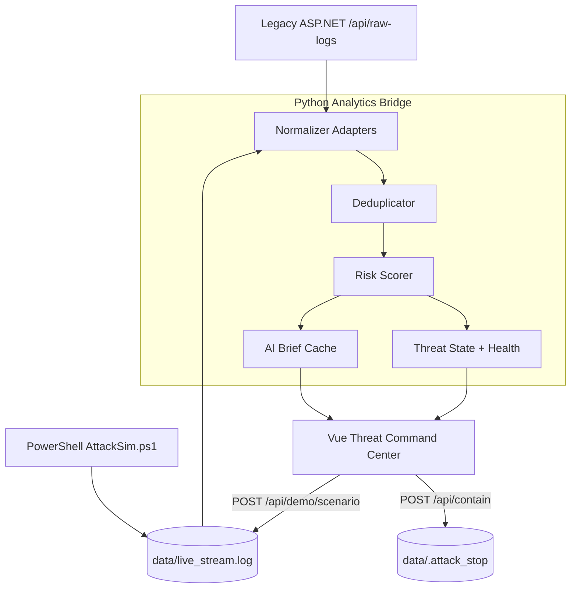

# Threat Command Center

**Project Frankenstein’s Dashboard** — bridge a legacy ASP.NET logger and PowerShell **AttackSim** stream through a Python analytics engine into one interactive **Threat Command Center** (dark-mode HTML5/JS + Vue).

> [Application Engineer challenge spec](https://github.com/Joe-Juette/tc-Frankenstein)

## Challenge deliverables (checklist for reviewers)

| # | Requirement | Implementation |
|---|-------------|----------------|
| 1 | **Analytics Bridge (Python)** — tail `live_stream.log` + poll Legacy API, score events | `bridge/ingest.py`, `bridge/scorer.py`, `bridge/main.py` |
| 2 | **Command Center (HTML5/JS)** — dark mode, **live feed**, **global gauge → red** on high severity | `dashboard/app.mjs`, WebSocket `/ws/threats` |
| 3 | **Sales edge** (jaw-drop feature) | **AI Threat Brief** + playbook (`bridge/brief.py`), **Contain** stops AttackSim (`POST /api/contain` → `data/.attack_stop`), **Lumi** voice-guided copilot tour |
| 4 | **Public GitHub repo** | Push this repository; reply to the challenge email with the clone URL |

**Run locally:** `bash ./scripts/start-demo.sh` → http://127.0.0.1:8000

| Component | Path |
|-----------|------|
| Legacy Core (ASP.NET) | `legacy/Program.cs` — `GET /api/raw-logs` on `:5080` |
| Chaos Monkey (PowerShell) | `chaos/AttackSim.ps1` → `data/live_stream.log` |
| Bridge + UI | `:8000` |

## Demo Engineering Trifecta

| Criterion | How this repo addresses it |
|-----------|----------------------------|
| **Aesthetic (40%)** | Dark executive SOC UI (PAN-aligned command center), live telemetry, CRITICAL gauge theatrics, analytics tiles — built for CISO demos, not a 2010 internal tool |
| **Architecture (40%)** | C# → Python adapters → ThreatEvent v1 → WebSocket console; contain hook closes loop to PowerShell sim (see mermaid below) |
| **The Vibe (20%)** | AI-assisted velocity: Cursor/LLM for scaffold, bridge API, Vue shell, copilot narration, and CSS; human-owned scoring contract, dedup, security boundaries, and demo flow |

## Executive summary

| Capability | Outcome for the business |
|------------|-------------------------|
| **Unified ingest** | Legacy and modern sources appear as one event stream in the SOC |
| **ThreatEvent v1 contract** | New integrations plug in without redesigning the console |
| **Deterministic scoring** | Explainable risk and landscape posture — no black-box dependency |
| **AI Threat Summary** | CISO-ready language (optional LLM; template always works) |
| **Containment workflow** | Demonstrates response orchestration end-to-end in the demo sandbox |
| **Observable platform** | Per-source health — integration failures are visible immediately |

## What this demonstrates

- Legacy system integration (ASP.NET minimal API)
- Real-time event processing (PowerShell tail + WebSocket)
- **Canonical event contract** with schema versioning
- **At-least-once ingestion** with deduplication
- Deterministic risk scoring + separate global landscape score
- Security-aware engineering (validation, fixed paths, data minimization for LLM)
- AI-assisted analysis (optional, non-blocking)
- Customer-facing UX (Vue 3 command center)
- Observable integration health + graceful degradation

## 30-second demo

```bash
chmod +x scripts/start-demo.sh
./scripts/start-demo.sh
```

Open [http://127.0.0.1:8000](http://127.0.0.1:8000). **Lumi** intro: challenge problem + architecture → optional voice tour → inject→contain workflow.

1. Confirm telemetry health: **Legacy API** + **Attack Stream** online (under live queue)  
2. **Response** → **Critical** → **Inject campaign** (or action dock **Inject**)  
3. Watch **landscape gauge** hit **CRITICAL** and **live feed** update from AttackSim  
4. **Intelligence** → **Executive brief** (AI summary; optional `OPENAI_API_KEY`)  
5. **Initiate containment** → AttackSim stops, **CONTAINED**, gauge decays  

### Prerequisites

- .NET 8 SDK  
- Python 3.11+  
- PowerShell `pwsh` (attack simulator)  
Optional: `.env` with `OPENAI_API_KEY` for LLM briefs (template brief works without a key).

### Troubleshooting (Apple Silicon)

If you see `pydantic_core ... incompatible architecture`, run:

```bash
rm -rf bridge/.venv
./scripts/start-demo.sh
```

Prefer **Terminal/zsh** over x86_64 PowerShell when possible.

---

## Architecture



**Ports:** Legacy `5080` · Bridge + UI `8000`

New telemetry sources only need an **adapter** that emits `ThreatEvent` v1 — scoring, brief, and UI stay unchanged.

A **reference architecture diagram** ships with the UI (`dashboard/assets/architecture-tcc.svg`) — suitable for Lucidchart / Excalidraw parity in reviews.

---

## Problem statement (Bridge Builder mission)

Legacy SaaS telemetry is **reliable but static** — buyers need to **see** real-time threat handling. Operating **ASP.NET raw logs** and a **PowerShell live stream** without one contract splits the queue, diverges scores, and leaves executive reporting behind the SOC.

| Pain | Impact |
|------|--------|
| **Static story** | CISO demos fail when the product does not move on the glass |
| **Dual telemetry paths** | Legacy API vs live stream monitored in separate mental models |
| **Inconsistent scoring** | Risk and landscape cannot be explained uniformly |
| **Fragmented queue** | Analysts context-switch instead of one ThreatEvent stream |

## How Threat Command Center solves it

1. **Ingest** — Legacy ASP.NET (`:5080`) and PowerShell live stream append to one pipeline.  
2. **Normalize** — Bridge adapters map both paths to **ThreatEvent v1**.  
3. **Dedupe & score** — Deterministic rules produce per-event risk and a decayed **global landscape** score.  
4. **Publish** — WebSocket pushes unified state to the Vue console (posture, analytics, SOC queue).  
5. **Intelligence** — Executive brief + playbook from a minimized telemetry window (LLM optional).  
6. **Respond** — Containment and campaign inject hooks close the loop (simulator stop-flag in this repo).

Implementation detail lives in `bridge/` (scoring, brief, WebSocket), `legacy/`, `chaos/AttackSim.ps1`, and `dashboard/app.mjs`.

---

## AI Copilot (Lumi)

Lumi is the embedded **AI Copilot guide** — production-oriented copy (not a “demo script”). On **every page refresh**:

| Phase | What happens |
|-------|----------------|
| **1. Intro modal** | Problem statement, implementation bullets, architecture diagram, voice overview |
| **2. Product tour** | ~20 steps: header, navigation, posture, analytics, telemetry, health, brief, playbook, Lumi assistant |
| **3. Operational workflow** | Copilot **injects** a critical campaign, refreshes the brief, **initiates containment**, highlights export |
| **4. Replay** | Toolbar **AI Copilot guide** restarts the full flow |

Narration scripts: `bridge/narration_scripts.py` · Voice assets: `./scripts/generate-narration.sh` → `dashboard/assets/narration/` · API: `GET /api/narration/intro`, `GET /api/narration/tour`

---

## Canonical ThreatEvent contract (v1)

| Field | Description |
|-------|-------------|
| `schema_version` | Contract version (`1.0`) |
| `event_id` | Deterministic ID (hash of source + time + attack + IPs + destination) |
| `timestamp` | Event time (UTC) |
| `source` | `legacy_api` \| `live_stream` \| `soc_console` |
| `attack_type` | Technique / log event name |
| `source_ip` | Origin identifier |
| `destination` | Target asset (e.g. `web-app-01`) |
| `status` | `Detected`, `Failed`, `Contained`, … |
| `raw_severity` | 1–10 |
| `metadata` | Upstream context (validated, non-authoritative) |

After scoring, clients also receive:

- `risk_score` (0–100, **per event**)
- `threat_level` (event classification)
- `global_score` (**landscape**, time-decayed)

Example:

```json
{
  "schema_version": "1.0",
  "event_id": "evt-8f21a2c91b4d",
  "timestamp": "2026-09-29T16:44:32Z",
  "source": "live_stream",
  "attack_type": "SQL Injection",
  "source_ip": "103.25.12.200",
  "destination": "web-app-01",
  "status": "Detected",
  "raw_severity": 9,
  "risk_score": 92,
  "threat_level": "CRITICAL"
}
```

---

## Scoring model

### Event `risk_score` (deterministic)

- Attack-type weight × `(raw_severity / 10)` × 100  
- +15 when legacy status is Failed / Denied / Blocked  

### Global landscape score (separate)

Computed from recent events with:

- **Time decay** (exponential, ~45s half-life)  
- **Frequency** (events in last 60s)  
- **Attack diversity** (unique techniques)  
- **Containment decay** after demo CONTAIN THREAT  

One historical critical event does **not** permanently lock the gauge critical.

---

## API

| Endpoint | Purpose |
|----------|---------|
| `GET /api/state` | Gauge, feed, health, containment status |
| `GET /api/health` | Component health snapshot |
| `GET /api/brief` | AI / template executive brief |
| `POST /api/demo/scenario` | Inject demo telemetry (`normal`, `port_scan`, `brute_force`, `critical`) |
| `POST /api/contain` | Demo containment (writes stop flag, decays landscape) |
| `WS /ws/threats` | Live events + state + health |

Legacy alias: `POST /api/mitigate` → same as contain.

---

## Graceful degradation

| Failure | Behavior |
|---------|----------|
| Legacy API down | Status **DEGRADED**, live stream continues |
| AttackSim stopped | Stream **STOPPED**, history remains |
| WebSocket drop | Auto-reconnect + `GET /api/state` hydration |
| LLM unavailable | Template CISO brief |
| Bridge restart | Clients reconnect; state rebuilt from recent window |

---

## Security considerations

- No secrets in repository — use `.env` / environment variables  
- Pydantic validation at ingestion boundary  
- Fixed filesystem paths under `data/` (no user-controlled paths)  
- Same-origin dashboard (no CORS surface for UI)  
- LLM receives **minimal normalized fields** from the last ~12 events only  
- HTML rendering uses Vue text bindings (escaped by default)  
- Containment endpoint is a **demo control** (local stop flag), not production blocking  

---

## Key architecture decisions

| Decision | Rationale |
|----------|-----------|
| Python bridge | Normalizes heterogeneous legacy + file telemetry behind one contract |
| WebSocket | Threat data is streaming; avoids browser polling latency |
| Deterministic scoring | Explainable, demo-reliable; AI is not on the critical path |
| Optional LLM | Narrative enrichment without runtime dependency for core detection |
| Deduplication | Poll + tail ingestion is at-least-once |
| Vue 3 dashboard | Rich interactive UX for demo storytelling |
| Same-origin static hosting | Simpler security model for reviewers |

---

## 60-second demo script (for interview)

| Time | Action / narration |
|------|---------------------|
| 0:00 | “This is the Threat Command Center — two independent telemetry sources.” |
| 0:10 | Point to **System Status**: Legacy API + Attack Stream online |
| 0:15 | Show live normalized event arriving in feed |
| 0:20 | **Inject campaign** (Critical) |
| 0:30 | Gauge **CRITICAL**, brief updates |
| 0:40 | **Initiate containment** |
| 0:50 | Attack simulator stops, status **CONTAINED**, gauge decays |
| 1:00 | “The UI never cares where telemetry originated — adapters produce `ThreatEvent`, then scoring and presentation are shared.” |

---

## Development layout

```
legacy/     ASP.NET raw logs API
chaos/      AttackSim.ps1
bridge/     FastAPI analytics bridge
dashboard/  Vue 3 ESM command center (Lumi copilot, voice tour — no npm build)
scripts/    start-demo.sh, generate-narration.sh
data/       live_stream.log (runtime), .attack_stop (contain flag)
```

UI loads from `dashboard/app.mjs`; Vue runtime is vendored on first `./scripts/start-demo.sh` run.

Regenerate Lumi voice clips after editing `bridge/narration_scripts.py`:

```bash
./scripts/generate-narration.sh
```

## Publish (public GitHub — deliverable 4)

```bash
gh auth login
gh repo create frankenstein-threat-command-center --public --source=. --remote=origin --push
```

Send the repository URL in your reply to the **Tech Challenge intro email**.

## License

MIT — see [LICENSE](LICENSE).
