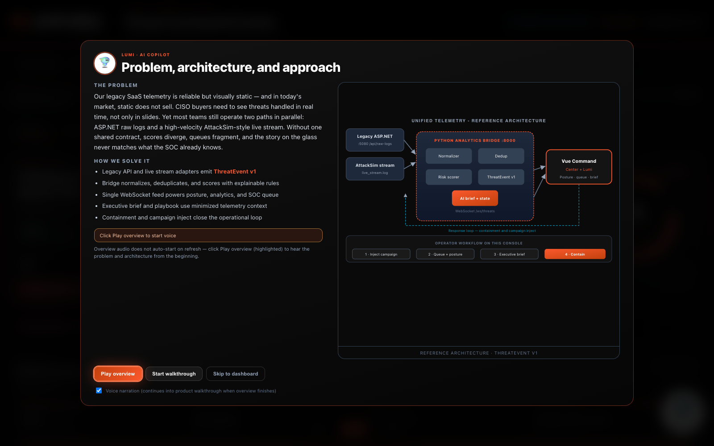
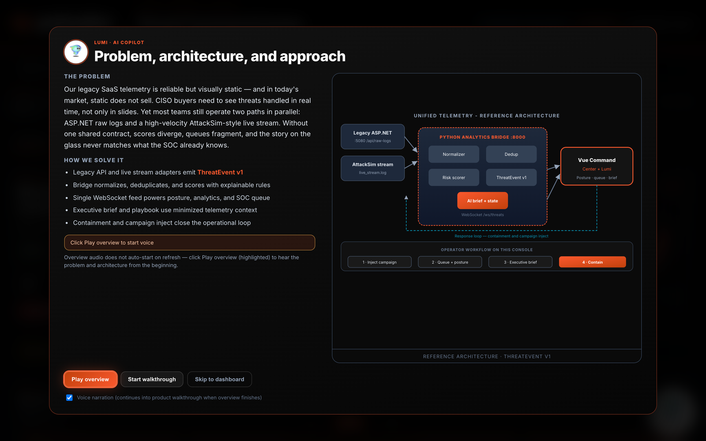
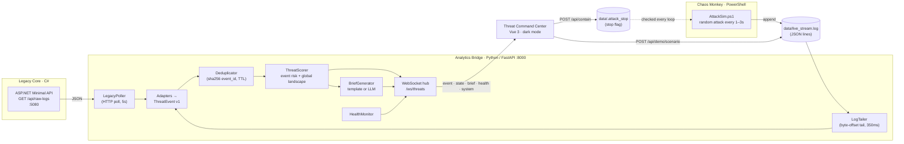
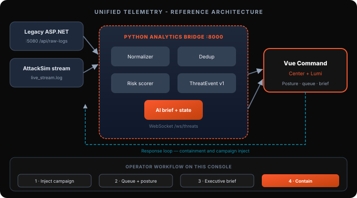

# Threat Command Center — Project Frankenstein 2.0

> **Palo Alto Networks · Application Engineer Technical Challenge**
> Bridging a legacy **ASP.NET** logger and a **PowerShell** "Chaos Monkey" through a **Python** analytics engine into a live, dark-mode **Threat Command Center** built for CISO demos.

Challenge spec: [Joe-Juette/tc-Frankenstein](https://github.com/Joe-Juette/tc-Frankenstein)



---

## Table of contents

1. [Run it in 60 seconds](#1-run-it-in-60-seconds)
2. [Deliverables checklist](#2-deliverables-checklist)
3. [How it maps to the evaluation criteria](#3-how-it-maps-to-the-evaluation-criteria)
4. [Architecture](#4-architecture)
5. [Component deep dive](#5-component-deep-dive)
6. [The ThreatEvent v1 contract](#6-the-threatevent-v1-contract)
7. [Scoring model](#7-scoring-model)
8. [The "Sales Edge" features](#8-the-sales-edge-features)
9. [API reference](#9-api-reference)
10. [Configuration](#10-configuration)
11. [Resilience & graceful degradation](#11-resilience--graceful-degradation)
12. [Security considerations](#12-security-considerations)
13. [Key design decisions](#13-key-design-decisions)
14. [How AI tools were used ("The Vibe")](#14-how-ai-tools-were-used-the-vibe)
15. [Repository layout](#15-repository-layout)
16. [Tests](#16-tests)
17. [Troubleshooting](#17-troubleshooting)
18. [Known limitations & next steps](#18-known-limitations--next-steps)

---

## 1. Run it in 60 seconds

### Prerequisites

| Tool | Version | Used for |
|------|---------|----------|
| [.NET SDK](https://dotnet.microsoft.com/download) | 8.0 | Legacy Core (`legacy/`) |
| Python | 3.11+ | Analytics Bridge (`bridge/`) |
| [PowerShell](https://learn.microsoft.com/powershell/scripting/install/installing-powershell) (`pwsh`) | 7.x | Chaos Monkey (`chaos/AttackSim.ps1`) |
| A modern browser | Chrome / Edge / Safari | Command Center UI |

Optional: an `OPENAI_API_KEY` to have an LLM write the executive brief. Everything works without one (see [§8](#8-the-sales-edge-features)).

### One command

```bash
git clone https://github.com/rajsaurabh1000/frankenstein-threat-command-center.git
cd frankenstein-threat-command-center
cp .env.example .env          # optional — add OPENAI_API_KEY if you have one
chmod +x scripts/start-demo.sh
./scripts/start-demo.sh
```

Then open **http://127.0.0.1:8000** (the script opens it automatically on macOS).

`start-demo.sh` does the following:

1. Frees ports `5080` / `8000` if a previous demo is still running.
2. Downloads a local copy of Vue 3 into `dashboard/vendor/` if it is missing (so the UI works on networks that block CDNs).
3. Truncates `data/live_stream.log` and clears any old containment stop flag.
4. Creates `bridge/.venv` (repairing it automatically on Apple Silicon architecture mismatches) and installs `bridge/requirements.txt`.
5. Starts **Legacy Logger** (`dotnet run`, `:5080`) → **Analytics Bridge** (`uvicorn`, `:8000`) → **AttackSim** (`pwsh`).
6. Cleans up all three processes on `Ctrl+C`.

### What you should see

1. The **Lumi AI Copilot** intro explains the problem and the architecture (with optional voice narration).
2. Click **Skip to dashboard** or **Start walkthrough** for a guided tour.
3. The live feed starts ticking as AttackSim generates attacks. Legacy API events are interleaved every few seconds.
4. Press **Inject** (Critical) in the bottom action dock. The gauge swings **red / CRITICAL**.
5. Press **Contain**. AttackSim stops itself, the status shows **CONTAINED**, and the gauge decays.

---

## 2. Deliverables checklist

| # | Requirement from the brief | Where it lives | Status |
|---|----------------------------|----------------|--------|
| 1 | **Analytics Bridge (Python)** — watches `live_stream.log` **and** the LegacyLogger API, scores each event | [`bridge/ingest.py`](bridge/ingest.py) (tailer + poller), [`bridge/scorer.py`](bridge/scorer.py) (scoring), [`bridge/main.py`](bridge/main.py) (FastAPI + WebSocket) | ✅ |
| 2a | **Command Center (HTML5/JS)** — dark-mode, "hacker-chic" | [`dashboard/`](dashboard/) — Vue 3 ESM, no build step | ✅ |
| 2b | **Live Feed** of incoming threats | WebSocket `/ws/threats` → Telemetry queue | ✅ |
| 2c | **Global threat gauge** that turns red on high-severity hits | Posture gauge (LOW → ELEVATED → HIGH → **CRITICAL**) driven by a time-decayed landscape score | ✅ |
| 3 | **"Sales Edge"** jaw-drop feature | **All three suggested examples, plus one more:** AI Threat Brief + playbook, **Contain** button that actually stops the PowerShell script, **Lumi** voice-guided AI copilot, and executive Q&A ("Ask Lumi") | ✅ |
| 4 | **Public GitHub repository** | This repo | ✅ |

---

## 3. How it maps to the evaluation criteria

| Criterion | Weight | What to look at |
|-----------|--------|-----------------|
| **Aesthetic** | 40% | Palo Alto–branded dark SOC console: animated posture gauge, live telemetry queue, analytics tiles, executive brief, action dock, a guided copilot tour with neural-voice narration. See the [screenshots](#screenshots). |
| **Architecture** | 40% | C# → Python → browser in one flow, with a **canonical `ThreatEvent` v1 contract**, source adapters, deterministic IDs, deduplication, explainable scoring, per-source health, WebSocket push, and a **closed response loop** back to PowerShell via a stop-flag file. See [§4](#4-architecture). |
| **The Vibe** | 20% | AI tools generated the boilerplate (FastAPI scaffold, Vue shell, CSS, narration copy), while the parts that need judgment were designed by hand: the contract, scoring, dedup, and security boundaries. See [§14](#14-how-ai-tools-were-used-the-vibe). |

### Screenshots

| Lumi AI Copilot intro (problem + architecture) | Command Center at CRITICAL posture |
|---|---|
|  |  |

---

## 4. Architecture



The same topology as it ships inside the product (Lumi's intro modal renders this diagram):



### End-to-end data flow

1. **Produce.** `AttackSim.ps1` appends one compressed JSON object per line to `data/live_stream.log`. The legacy ASP.NET API serves its raw log array at `GET /api/raw-logs`.
2. **Ingest.** The bridge runs two concurrent asyncio loops:
   - `LogTailer` reads only the new bytes past its last file offset, every 350 ms.
   - `LegacyPoller` calls the legacy API every 5 s.
3. **Normalize.** Source-specific adapters (`live_entry_to_event`, `legacy_row_to_event`) map each raw shape to the canonical **`ThreatEvent` v1** model. Pydantic validates it at this boundary.
4. **Dedupe.** Each event gets a deterministic `event_id` (a SHA-256 of source, timestamp, attack, IP, and destination). A bounded TTL cache drops repeats, which makes at-least-once ingestion safe.
5. **Score.** `ThreatScorer` assigns a per-event `risk_score` (0–100) and `threat_level`, and updates the time-decayed **global landscape score** that drives the gauge.
6. **Enrich.** `BriefGenerator` refreshes the executive brief and playbook, throttled to at most once every 20 s unless forced. It uses an LLM when one is configured and otherwise falls back to a deterministic template.
7. **Publish.** Everything is pushed to browsers over a single WebSocket (`/ws/threats`). Message types are `event`, `state`, `brief`, `health`, and `system`.
8. **Respond.** **Contain** calls `POST /api/contain`. The bridge writes `data/.attack_stop`, AttackSim sees the flag on its next loop and exits, and the landscape score decays over about 12 s.

**Adding a new telemetry source only means writing one adapter that emits `ThreatEvent`.** Scoring, the brief, and the UI stay the same.

### Ports

| Service | Port | Bound to |
|---------|------|----------|
| Legacy Logger (ASP.NET) | `5080` | `127.0.0.1` |
| Analytics Bridge + UI (FastAPI) | `8000` | `127.0.0.1` |

---

## 5. Component deep dive

### 5.1 Legacy Core — ASP.NET ([`legacy/Program.cs`](legacy/Program.cs))

The minimal API from the brief, kept as close to the original as possible:

- **Same default response.** The same three records (`Login Attempt` / `SSH Connection` / `File Access`) with the same PascalCase fields `Timestamp`, `Source`, `Event`, and `Status`.
- **Bound to `127.0.0.1:5080`**, with a CORS policy limited to the bridge origin.
- **Optional `?jitter=true`.** This randomizes the first record's source, event, and status so the legacy feed keeps producing *new* events during a long demo instead of the same three rows. The bridge turns jitter on only after its first bootstrap poll.

### 5.2 Chaos Monkey — PowerShell ([`chaos/AttackSim.ps1`](chaos/AttackSim.ps1))

Same attack generator as the brief (Brute Force / SQL Injection / Port Scan / Credential Stuffing, severity 1–9, origin `103.25.12.x`, 1–3 s cadence), with three demo-critical changes:

| Change | Why |
|--------|-----|
| Writes to `<repo>/data/live_stream.log`, resolved from the script's own location | Works no matter which directory it is launched from |
| `Add-Content -Encoding utf8` instead of `Out-File -Append` | Windows PowerShell 5.1's `Out-File` defaults to UTF-16LE, which breaks naive line readers |
| Checks for `data/.attack_stop` on every iteration and exits cleanly | Lets the dashboard's **Contain** button genuinely stop the attack (the "Mitigate" example from the brief) |

### 5.3 Analytics Bridge — Python ([`bridge/`](bridge/))

| Module | Responsibility |
|--------|----------------|
| [`main.py`](bridge/main.py) | FastAPI app, background ingest loops, ingest pipeline, REST + WebSocket endpoints, static hosting of the dashboard |
| [`ingest.py`](bridge/ingest.py) | `LogTailer` (offset-based tail; tolerant parser that pulls JSON objects out of partial or concatenated writes) and `LegacyPoller` (HTTP poll + bootstrap/jitter handling), plus the two source adapters |
| [`models.py`](bridge/models.py) | Pydantic models: `ThreatEvent`, `ScoredEvent`, `ThreatState`, `SystemHealth`, `AiInsights`, request/response DTOs |
| [`dedup.py`](bridge/dedup.py) | Deterministic `event_id` + bounded, TTL-evicting `EventDeduplicator` (2 000 entries / 1 h) |
| [`scorer.py`](bridge/scorer.py) | Per-event risk scoring and the time-decayed global landscape score (see [§7](#7-scoring-model)) |
| [`brief.py`](bridge/brief.py) | Executive brief, playbook, recommendations, and executive Q&A. Uses the OpenAI Chat Completions API when a key is set and a deterministic template otherwise |
| [`health.py`](bridge/health.py) | Per-component health: Legacy API, Live Telemetry, Analytics Bridge, WebSocket, AI Enrichment |
| [`scenario.py`](bridge/scenario.py) | Scripted attack packs (`normal`, `port_scan`, `brute_force`, `critical`) appended to the same log file, so injected events travel the **real** ingest path |
| [`narration.py`](bridge/narration.py), [`narration_scripts.py`](bridge/narration_scripts.py) | Lumi copilot copy + neural TTS (Microsoft Edge `en-US-JennyNeural`) with an on-disk MP3 cache |

### 5.4 Command Center — HTML5/JS ([`dashboard/`](dashboard/))

- **Vue 3 as a native ES module.** The runtime is vendored in `dashboard/vendor/`, so there is **no npm, no bundler, and no build step**. The bridge serves the UI from the same origin.
- **Four workspaces**, switchable with keyboard shortcuts `1`–`4`:
  - **Posture:** global gauge, headline, KPIs, analytics tiles.
  - **Telemetry:** live SOC queue with per-source health.
  - **Intelligence:** executive brief, playbook, recommendations.
  - **Response:** inject scenarios and contain.
- **Floating action dock** with **Inject**, **Brief**, and **Contain**, always one click away during a demo.
- **Auto-reconnecting WebSocket.** After a reconnect the UI rehydrates from `GET /api/state`.
- **Export Summary.** Downloads a posture and brief snapshot to hand to leadership.
- **Theming** lives in `themes.css`, `styles.css`, `world-ui.css`, `leadership-layout.css`, and `motion.css`: Palo Alto orange accents, glow and pulse on critical states, and reduced-motion–friendly transitions.

---

## 6. The ThreatEvent v1 contract

Every source is normalized to this shape before anything downstream sees it ([`bridge/models.py`](bridge/models.py)):

| Field | Type | Description |
|-------|------|-------------|
| `schema_version` | `str` | Contract version (`"1.0"`) |
| `event_id` | `str` | Deterministic `evt-<sha256[:12]>` of source + timestamp + attack + IP + destination |
| `timestamp` | `datetime` | Event time (UTC) |
| `source` | enum | `legacy_api` \| `live_stream` \| `soc_console` |
| `attack_type` | `str` | Technique or legacy event name |
| `source_ip` | `str` | Origin |
| `destination` | `str` | Target asset (`web-app-01`, `legacy-saas-core`, …) |
| `status` | `str` | `Detected`, `Failed`, `Denied`, `Blocked`, `Contained`, … |
| `raw_severity` | `int` 1–10 | Upstream severity (validated range) |
| `metadata` | `dict` | Original raw payload + upstream tag (non-authoritative) |

After scoring, clients also receive `risk_score` (0–100), `threat_level`, `global_score`, and `global_threat_level`.

### Source mapping

| Raw field | Live stream (PowerShell) | Legacy API (C#) |
|-----------|--------------------------|-----------------|
| `attack_type` | `type` | `Event` |
| `source_ip` | `origin` | `Source` |
| `timestamp` | `time` (`HH:mm:ss`, today UTC) | `Timestamp` (ISO-8601) |
| `status` | `"Detected"` | `Status` |
| `raw_severity` | `severity` (clamped 1–10) | derived: `6` if Failed/Denied/Blocked, else `4` |
| `destination` | `web-app-01` | `legacy-saas-core` |

### Example (as broadcast on the WebSocket)

```json
{
  "type": "event",
  "payload": {
    "event": {
      "schema_version": "1.0",
      "event_id": "evt-8f21a2c91b4d",
      "timestamp": "2026-09-29T16:44:32Z",
      "source": "live_stream",
      "attack_type": "SQL Injection",
      "source_ip": "103.25.12.200",
      "destination": "web-app-01",
      "status": "Detected",
      "raw_severity": 9,
      "metadata": { "upstream": "live_stream.log" }
    },
    "risk_score": 90.0,
    "threat_level": "CRITICAL",
    "global_score": 81.4,
    "global_threat_level": "CRITICAL"
  }
}
```

---

## 7. Scoring model

Scoring is **deterministic and explainable**, so a CISO can ask "why is this red?" and get a real answer. AI is used for the narrative, never for the detection path.

### 7.1 Per-event `risk_score` (0–100)

```
risk = attack_weight × (raw_severity / 10) × 100
     + 15   if status ∈ {Failed, Denied, Blocked}
clamped to [0, 100]
```

| Attack type | Weight | | Attack type | Weight |
|-------------|--------|-|-------------|--------|
| SQL Injection | 1.00 | | SSH Connection | 0.75 |
| Admin Escalation | 0.95 | | File Access | 0.70 |
| Credential Stuffing | 0.90 | | Port Scan | 0.65 |
| Brute Force | 0.85 | | Login Attempt | 0.55 |
| DNS Query | 0.40 | | *unknown* | 0.50 |

**Event level:** `CRITICAL` if severity ≥ 9 or risk ≥ 90 · `HIGH` if severity ≥ 7 or risk ≥ 72 · `ELEVATED` if risk ≥ 42 · otherwise `LOW`.

### 7.2 Global landscape score (the gauge)

One critical hit from ten minutes ago should **not** pin the gauge red forever. The landscape score is computed over a sliding 120 s window:

| Component | Formula |
|-----------|---------|
| Recency-weighted mean | each event weighted by `exp(-age / 45s)` |
| Diversity bonus | `+3` per unique technique, max `+12` |
| Frequency bonus | `+1.5` per event in the last 60 s, max `+12` |
| Peak floor | if any event in the last 30 s has risk ≥ 85, score ≥ `0.85 × peak` |
| Containment | after **Contain**, score decays linearly to ~0 over 12 s, then floors at ≤ 18 and bleeds off |

**Gauge level:** `CRITICAL` ≥ 78 · `HIGH` ≥ 58 · `ELEVATED` ≥ 35 · `LOW` < 35.

This is why a single severity-9 SQL Injection flips the gauge red immediately (the peak floor), and why it relaxes on its own once the attack stops (the decay).

---

## 8. The "Sales Edge" features

The brief asked for **one** jaw-drop feature. This build covers all three suggested examples and adds a fourth:

### 🧠 AI Threat Brief + Playbook (the "AI Summary")
- A 3–4 sentence CISO-grade summary of the current campaign, plus a named **playbook** with three recommendations and a confidence score.
- **With `OPENAI_API_KEY`:** the brief comes from `gpt-4o-mini` (configurable). The model sees a **minimized** context of only the last 12 events, reduced to `attack|ip|severity|risk|level`, with no raw payloads.
- **Without a key:** a deterministic template produces the same structure from the same data, so the demo never breaks on Wi-Fi or quota issues.
- Refreshes automatically on landscape changes (throttled to one every 20 s) and on demand with **Refresh Brief**.

### 🛑 Contain (the "Mitigate button that stops the PowerShell script")
- `POST /api/contain` writes `data/.attack_stop`. AttackSim checks for the file on every iteration and **exits**.
- The bridge adds a `CONTAINMENT` event to the feed, marks the stream **STOPPED**, decays the landscape score, and forces a fresh brief.
- **Inject** clears the flag again, so the demo can loop: inject → critical → contain → inject.

### 🤖 Lumi — AI Copilot guide with voice
- On load, an intro modal presents the problem statement, how it's solved, and the reference architecture diagram.
- **Play overview** narrates the full overview (problem statement, then approach) from 0:00. Nothing auto-plays on page load, so browser autoplay rules never cut in mid-sentence. **Replay overview** stops everything, including a running tour, and restarts from the beginning.
- **Start walkthrough** runs about 20 spotlighted tour steps across the console, and the copilot then runs the operational flow itself: inject a campaign, refresh the brief, and initiate containment. The guide bar offers **Pause** / **Read aloud** / **Back** / **Next highlight**.
- Each intro or tour run carries a token, so delayed continuations (auto-advance timers, step actions, audio callbacks) from an abandoned run can never talk over a newer one.
- The voice clips are **pre-generated and committed** (`dashboard/assets/narration/`), so narration works offline. A clip is only used if its digest matches the current script text. Otherwise the bridge generates it live via `edge-tts` and caches it, so an edited script never plays a stale clip.

### 💬 Ask Lumi — executive Q&A
- A CISO can type a free-form question ("Should we isolate the web tier?") and get a 2–3 sentence answer grounded **only** in current telemetry. It uses the LLM when one is configured and a template otherwise.

---

## 9. API reference

All endpoints are served by the bridge on `http://127.0.0.1:8000`. Interactive OpenAPI docs are at **`/docs`**.

| Method | Path | Purpose |
|--------|------|---------|
| `GET` | `/` | Command Center UI |
| `WS` | `/ws/threats` | Live push: `event`, `state`, `brief`, `health`, `system` messages. Sends a full `state` + `brief` on connect |
| `GET` | `/api/state` | Full snapshot: global score/level, recent scored events, containment status, health |
| `GET` | `/api/health` | Per-component health |
| `GET` | `/api/brief` | Current executive brief (text + mode + insights) |
| `GET` | `/api/ai/insights` | Playbook, recommendations, confidence, focal insight |
| `POST` | `/api/ai/brief/regenerate` | Force a brief refresh |
| `POST` | `/api/ai/ask` | Executive Q&A — body `{"question": "..."}` |
| `POST` | `/api/demo/scenario` | Inject an attack pack — body `{"scenario": "normal" \| "port_scan" \| "brute_force" \| "critical"}` |
| `POST` | `/api/contain` | Containment: stop AttackSim, decay landscape |
| `POST` | `/api/mitigate` | Alias of `/api/contain` (matches the brief's wording) |
| `GET` | `/api/platform` | Console metadata (env, region, tenant, version) |
| `GET` | `/api/narration/intro`, `/api/narration/tour` | Lumi narration scripts |
| `POST` | `/api/narration/speak` | Text → cached neural-voice MP3 |

### Try it from the terminal

```bash
# Current posture
curl -s http://127.0.0.1:8000/api/state | python3 -m json.tool | head -20

# Push the gauge to CRITICAL
curl -s -X POST http://127.0.0.1:8000/api/demo/scenario \
  -H 'content-type: application/json' -d '{"scenario":"critical"}'

# Contain — AttackSim prints "Stop flag detected — attack simulation halted."
curl -s -X POST http://127.0.0.1:8000/api/contain

# Ask the copilot
curl -s -X POST http://127.0.0.1:8000/api/ai/ask \
  -H 'content-type: application/json' -d '{"question":"What should we do now?"}'
```

---

## 10. Configuration

Copy `.env.example` to `.env` (it is git-ignored). `start-demo.sh` loads it automatically.

| Variable | Default | Description |
|----------|---------|-------------|
| `OPENAI_API_KEY` | *(empty)* | Enables LLM brief, recommendations, and Q&A. Leave empty for template mode |
| `OPENAI_MODEL` | `gpt-4o-mini` | Chat model used for enrichment |
| `LLM_BRIEF_ENABLED` | `true` | Kill-switch for LLM calls even when a key is present |
| `LEGACY_API_URL` | `http://127.0.0.1:5080` | Where the bridge polls the legacy API |
| `DATA_DIR` | `<repo>/data` | Location of `live_stream.log`, the stop flag, and the narration cache |
| `DASHBOARD_DIR` | `<repo>/dashboard` | Static UI directory served by the bridge |
| `EDGE_TTS_VOICE` | `en-US-JennyNeural` | Voice for Lumi narration |
| `DEPLOY_ENV`, `TCC_REGION`, `TCC_TENANT`, `TCC_VERSION`, `TCC_BUILD` | `enterprise`, `us-west-2`, `primary`, `1.0.0`, `release` | Cosmetic console metadata shown in the header / exports |

### Running components individually

```bash
# 1. Legacy Core
cd legacy && dotnet run --urls http://127.0.0.1:5080

# 2. Analytics Bridge
cd bridge && python3 -m venv .venv && .venv/bin/pip install -r requirements.txt
DATA_DIR=../data LEGACY_API_URL=http://127.0.0.1:5080 .venv/bin/uvicorn main:app --port 8000

# 3. Chaos Monkey
pwsh -File chaos/AttackSim.ps1
```

### Docker Compose (optional)

A `docker-compose.yml` with `legacy`, `bridge`, and `chaos` services is included (`docker compose up`, then open http://127.0.0.1:8000). The legacy API binds to loopback by default and honors `--urls` / `ASPNETCORE_URLS`, which Compose uses to bind `0.0.0.0`. `./scripts/start-demo.sh` remains the primary, end-to-end-tested path.

---

## 11. Resilience & graceful degradation

| Failure | Behavior |
|---------|----------|
| Legacy API down | Legacy health → **DEGRADED**; the live stream keeps flowing |
| AttackSim stopped / contained | Stream → **STOPPED**; history and brief remain |
| Partial / concatenated log writes | Tolerant regex parser recovers every complete JSON object |
| Duplicate events (poll + tail) | Dropped by deterministic `event_id` + TTL cache |
| WebSocket drop | Client auto-reconnects and rehydrates from `/api/state` |
| LLM unavailable, slow, or no key | Silent fallback to the template brief. Detection is unaffected |
| Browser blocks autoplay audio | Lumi shows a "Play overview" prompt; the tour still works silently |
| CDN blocked | Vue is vendored locally |

---

## 12. Security considerations

- **No secrets in the repo.** `.env` is git-ignored; `.env.example` holds placeholders only.
- **Validation at the boundary.** Every upstream payload passes through Pydantic (`raw_severity` is range-checked, types are coerced) before scoring.
- **Fixed filesystem paths.** The log, stop flag, and cache live under `DATA_DIR`, and no request can supply a path.
- **Loopback only.** Both services bind to `127.0.0.1`. The UI is same-origin with the bridge, and legacy CORS is restricted to the bridge origin.
- **Data minimization for the LLM.** Only the last 12 normalized events, reduced to type, IP, severity, risk, and level, are sent. Raw payloads and metadata are never sent.
- **XSS-safe rendering.** Vue text bindings escape by default.
- **Containment is a demo control.** It writes a local stop flag and is not production enforcement. In production this hook would call a firewall or EDR API (e.g. PAN-OS / Cortex XSOAR).

---

## 13. Key design decisions

| Decision | Rationale |
|----------|-----------|
| **Python bridge as the "adapter layer"** | Legacy and modern sources speak different shapes. One place normalizes them into a versioned contract |
| **Canonical `ThreatEvent` v1** | Decouples producers from consumers. New integrations don't touch scoring or UI |
| **Deterministic scoring, AI only for narrative** | Explainable, demo-reliable, zero runtime dependency on an LLM for detection |
| **Separate event risk vs. global landscape** | The per-event score answers "how bad is this hit?"; the landscape answers "how bad is *right now*?" |
| **File tail by byte offset** (not re-reading) | O(new bytes), works with any appending producer |
| **At-least-once + dedup** | Poll + tail can overlap. Idempotent IDs make that harmless |
| **WebSocket push** | Threats are a stream, so polling would add latency and load |
| **Stop-flag file for containment** | The simplest cross-language, cross-process control channel. Nothing needs to be installed in PowerShell |
| **Scenario injection through the real log file** | Demo buttons exercise the exact same ingest path as the attacker |
| **Vue 3 ESM with no build step** | Reviewers can read the code as shipped, and `git clone` → run works without Node |

---

## 14. How AI tools were used ("The Vibe")

The challenge rewards **velocity over artisan loops**. The work was split deliberately:

| Delegated to AI (Cursor + Claude / LLM pair-programming) | Owned by me (architecture & judgment) |
|----------------------------------------------------------|----------------------------------------|
| FastAPI scaffold, Pydantic models, endpoint boilerplate | The `ThreatEvent` v1 contract and source mappings |
| Vue 3 component shell, CSS theming, animations | The scoring formula, landscape decay, and thresholds |
| Lumi narration copy and tour step text | Dedup strategy and deterministic IDs |
| `start-demo.sh`, Dockerfiles, Apple Silicon venv repair | Security boundaries (LLM data minimization, fixed paths, loopback binds) |
| README drafting and diagrams | Closed-loop containment design (stop flag ↔ PowerShell) and the demo narrative |

The result is a demo that looks like a shipped product, with its architecture decisions written down and defensible.

---

## 15. Repository layout

```
frankenstein-threat-command-center/
├── legacy/                  # Legacy Core — ASP.NET 8 minimal API
│   ├── Program.cs           #   GET /api/raw-logs (+ optional ?jitter=true)
│   ├── LegacyLogger.csproj
│   └── Dockerfile
├── chaos/
│   └── AttackSim.ps1        # Chaos Monkey — writes data/live_stream.log, honors stop flag
├── bridge/                  # Analytics Bridge — Python / FastAPI
│   ├── main.py              #   app, pipeline, REST + WebSocket, static hosting
│   ├── ingest.py            #   LogTailer, LegacyPoller, source adapters
│   ├── models.py            #   ThreatEvent v1 + DTOs
│   ├── dedup.py             #   deterministic IDs + TTL dedup cache
│   ├── scorer.py            #   event risk + global landscape scoring
│   ├── brief.py             #   AI / template brief, playbook, Q&A
│   ├── health.py            #   per-component health
│   ├── scenario.py          #   demo attack packs
│   ├── narration.py         #   neural TTS + cache
│   ├── narration_scripts.py #   Lumi intro + tour copy
│   ├── requirements.txt
│   └── Dockerfile
├── dashboard/               # Command Center — Vue 3 ESM, no build step
│   ├── index.html
│   ├── app.mjs              #   UI, WebSocket client, tour, copilot
│   ├── narration.mjs        #   audio playback / autoplay handling
│   ├── architecture-diagram.mjs
│   ├── *.css                #   themes, layout, motion
│   ├── vendor/vue.esm-browser.js
│   └── assets/              #   logos, architecture SVG, Lumi, pre-generated narration MP3s
├── tests/                   # pytest: scorer, dedup, adapters, API end to end
├── scripts/
│   ├── start-demo.sh        # one-command local demo
│   ├── generate-narration.sh
│   └── generate_narration.py
├── data/                    # runtime: live_stream.log, .attack_stop (git-ignored)
├── docs/screenshots/
├── docker-compose.yml
├── .env.example
└── LICENSE (MIT)
```

---

## 16. Tests

A focused `pytest` suite (25 tests, under a second) covers the parts that carry the architecture:

| File | What it proves |
|------|----------------|
| [`tests/test_scorer.py`](tests/test_scorer.py) | Attack weights × severity, the +15 Failed/Denied/Blocked bump and cap, event-level thresholds, one critical hit flips the gauge CRITICAL, low noise stays LOW, containment decays the landscape |
| [`tests/test_dedup.py`](tests/test_dedup.py) | Deterministic, field-sensitive `event_id`s; a repeated observation is dropped; the cache is bounded |
| [`tests/test_ingest.py`](tests/test_ingest.py) | JSON-lines, concatenated, and truncated log writes; PowerShell and ASP.NET payloads both map to `ThreatEvent` v1; severity clamping and defaults |
| [`tests/test_api.py`](tests/test_api.py) | End to end through FastAPI: inject → real log-tail ingest → CRITICAL → contain writes the AttackSim stop flag; `/api/mitigate` alias; invalid scenarios rejected; template brief without an LLM |

```bash
python3 -m venv .venv-test
.venv-test/bin/pip install -r bridge/requirements.txt -r bridge/requirements-dev.txt
.venv-test/bin/python -m pytest -q
```

Tests run against a temporary `DATA_DIR` with the LLM disabled, so they never touch your demo data or call an external API.

---

## 17. Troubleshooting

| Symptom | Fix |
|---------|-----|
| `pydantic_core ... incompatible architecture` (Apple Silicon) | `rm -rf bridge/.venv && ./scripts/start-demo.sh`. The script rebuilds the venv natively. Prefer a native arm64 terminal over an x86_64 (Rosetta) shell |
| `pwsh not found` | Install PowerShell 7 (`brew install --cask powershell` on macOS), or run AttackSim manually: `pwsh -File chaos/AttackSim.ps1` |
| `dotnet: command not found` | Install the .NET 8 SDK. The script also checks `~/.dotnet` |
| Port 5080 / 8000 already in use | `start-demo.sh` frees them automatically. Otherwise `lsof -ti tcp:8000 \| xargs kill` |
| Gauge never moves | Check **Telemetry → health**. If Attack Stream is STOPPED, press **Inject** (it clears the stop flag) or restart AttackSim |
| No voice | Browsers block autoplay, so click **Play overview**. To regenerate clips after editing `narration_scripts.py`, run `./scripts/generate-narration.sh` |
| Brief says "template" | Expected without `OPENAI_API_KEY`. Add a key to `.env` and restart to use the LLM |

---

## 18. Known limitations & next steps

**Limitations (scoped for a 24-hour demo)**
- State lives in memory, so a bridge restart clears history (clients reconnect cleanly).
- Containment is a local stop flag, not a real enforcement action.
- Live-stream `time` is `HH:mm:ss` only, so the bridge assumes "today, UTC".
- Tests cover the bridge (scoring, dedup, adapters, API). The Vue UI is verified by hand in the browser, with no automated UI tests.

**Next steps toward production**
- Persist events to a time-series store and replay on restart.
- Replace the stop flag with a real response integration.
- Add any technique mapping to `ThreatEvent` and geo-IP enrichment for a 3D attack map.
- Property-based tests for the scorer, a WebSocket message-contract test, and Playwright smoke tests for the UI.
- AuthN/Z on the control endpoints (`/api/contain`, `/api/demo/*`).

---

**Author:** Saurabh Raj · [github.com/rajsaurabh1000](https://github.com/rajsaurabh1000)
