<p align="center">
  <picture>
    <source media="(prefers-color-scheme: dark)" srcset="dashboard/assets/palo-alto-networks-logo-light.png">
    <source media="(prefers-color-scheme: light)" srcset="dashboard/assets/palo-alto-networks-logo-dark.png">
    
  </picture>
</p>

# Threat Command Center — Project Frankenstein 2.0

> **Palo Alto Networks · Application Engineer Technical Challenge**
> Bridging a legacy **ASP.NET** logger and a **PowerShell** "Chaos Monkey" through a **Python** analytics engine into a live, dark-mode **Threat Command Center** built for CISO demos.

Challenge spec: [Joe-Juette/tc-Frankenstein](https://github.com/Joe-Juette/tc-Frankenstein)

[](https://github.com/rajsaurabh1000/frankenstein-threat-command-center/actions/workflows/ci.yml)

## 🚀 [Open the live Threat Command Center →](https://frankenstein-threat-command-center.onrender.com)

> Interactive and real time, with no installation. All three components (ASP.NET, Python, PowerShell) run in one container on Render's free tier.
> The first visit after a quiet period can take about a minute while the instance wakes up. On the public URL the AI runs in template mode, and a contained demo automatically resumes after 90 s.

**30-second tour:** click **Skip to dashboard** (or **Start walkthrough** for the narrated 27-step guide) → watch the threat meter flash **red** on each high-severity AttackSim hit → press **Inject** in the bottom dock, pick **Critical Attack**, then **Inject campaign**: the meter locks **CRITICAL**, the **critical-zone alarm** and siren start, and on the **Global attack map** arcs converge from three continents → press **Contain**: the PowerShell attacker stops, the alarm clears, the arcs halt and the meter falls to LOW. (Click once anywhere first: browsers only allow sound after an interaction.)

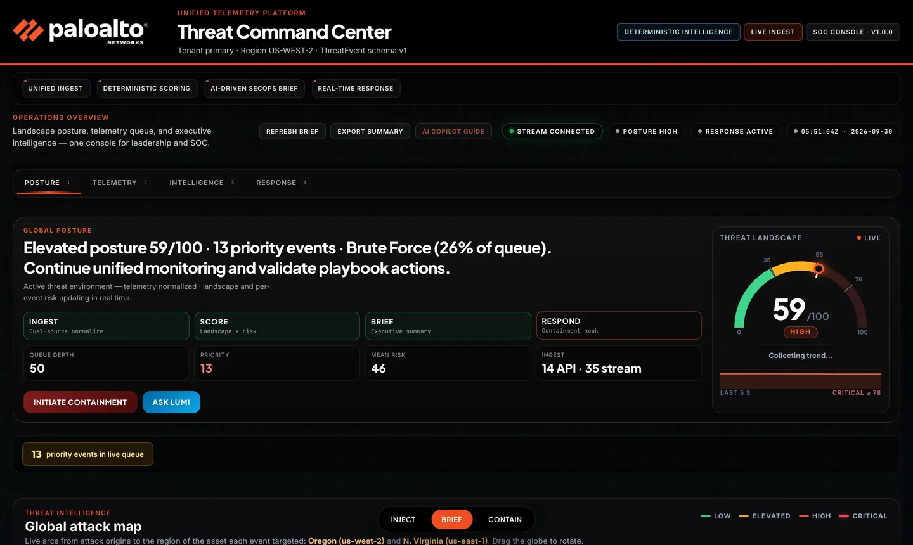

<sub>Recorded from the live site: live traffic → Inject (Critical) → CRITICAL 85 and the critical-zone alarm → arcs converge on the 3D attack globe → Contain → alarm clears, arcs halt.</sub>

---

## Table of contents

1. [Run it in 60 seconds](#1-run-it-in-60-seconds)
2. [Deliverables checklist](#2-deliverables-checklist)
3. [How it maps to the evaluation criteria](#3-how-it-maps-to-the-evaluation-criteria)
4. [Architecture](#4-architecture)
5. [Component deep dive](#5-component-deep-dive)
6. [The ThreatEvent v1 contract](#6-the-threatevent-v1-contract)
7. [Scoring model](#7-scoring-model)
8. [The "Sales Edge" features](#8-the-sales-edge-features)
9. [API reference](#9-api-reference)
10. [Configuration](#10-configuration)
11. [Resilience & graceful degradation](#11-resilience--graceful-degradation)
12. [Security considerations](#12-security-considerations)
13. [Key design decisions](#13-key-design-decisions)
14. [How AI tools were used ("The Vibe")](#14-how-ai-tools-were-used-the-vibe)
15. [Repository layout](#15-repository-layout)
16. [Tests](#16-tests)
17. [Troubleshooting](#17-troubleshooting)
18. [Known limitations & next steps](#18-known-limitations--next-steps)

---

## 1. Run it in 60 seconds

### Prerequisites

| Tool | Version | Used for |
|------|---------|----------|
| [.NET SDK](https://dotnet.microsoft.com/download) | 8.0 | Legacy Core (`legacy/`) |
| Python | 3.11+ | Analytics Bridge (`bridge/`) |
| [PowerShell](https://learn.microsoft.com/powershell/scripting/install/installing-powershell) (`pwsh`) | 7.x | Chaos Monkey (`chaos/AttackSim.ps1`) |
| A modern browser | Chrome / Edge / Safari | Command Center UI |

Optional: an `OPENAI_API_KEY` to have an LLM write the executive brief. Everything works without one (see [§8](#8-the-sales-edge-features)).

### One command

```bash
git clone https://github.com/rajsaurabh1000/frankenstein-threat-command-center.git
cd frankenstein-threat-command-center
cp .env.example .env          # optional — add OPENAI_API_KEY if you have one
chmod +x scripts/start-demo.sh
./scripts/start-demo.sh
```

Then open **http://127.0.0.1:8000** (the script opens it automatically on macOS).

`start-demo.sh` does the following:

1. Frees ports `5080` / `8000` if a previous demo is still running.
2. Downloads a local copy of Vue 3 into `dashboard/vendor/` if it is missing (so the UI works on networks that block CDNs).
3. Truncates `data/live_stream.log` and clears any old containment stop flag.
4. Creates `bridge/.venv` (repairing it automatically on Apple Silicon architecture mismatches) and installs `bridge/requirements.txt`.
5. Starts **Legacy Logger** (`dotnet run`, `:5080`) → **Analytics Bridge** (`uvicorn`, `:8000`) → **AttackSim** (`pwsh`).
6. Cleans up all three processes on `Ctrl+C`.

### What you should see

1. The **Lumi AI Copilot** intro explains the problem and the architecture (with optional voice narration).
2. Click **Skip to dashboard** or **Start walkthrough** for a guided tour.
3. The live feed starts ticking as AttackSim generates attacks. Legacy API events are interleaved every few seconds.
4. Press **Inject** (Critical) in the bottom action dock. The gauge swings **red / CRITICAL**.
5. Press **Contain**. AttackSim stops itself, the status shows **CONTAINED**, and the gauge decays.

---

## 2. Deliverables checklist

| # | Requirement from the brief | Where it lives | Status |
|---|----------------------------|----------------|--------|
| 1 | **Analytics Bridge (Python)** — watches `live_stream.log` **and** the LegacyLogger API, scores each event | [`bridge/ingest.py`](bridge/ingest.py) (tailer + poller), [`bridge/scorer.py`](bridge/scorer.py) (scoring), [`bridge/main.py`](bridge/main.py) (FastAPI + WebSocket) | ✅ |
| 2a | **Command Center (HTML5/JS)** — dark-mode, "hacker-chic" | [`dashboard/`](dashboard/) — Vue 3 ESM, no build step | ✅ |
| 2b | **Live Feed** of incoming threats | WebSocket `/ws/threats` → Telemetry queue | ✅ |
| 2c | **Global threat gauge** that turns red on high-severity hits | Posture gauge (LOW → ELEVATED → HIGH → **CRITICAL**) driven by a time-decayed landscape score. Every severity-9 hit from AttackSim flashes it **red** for 4 s | ✅ |
| 3 | **"Sales Edge"** jaw-drop feature | **All three suggested examples:** an **AI Threat Brief** + playbook, a **Contain** button that actually stops the PowerShell script, and a live **3D attack globe**. Plus a critical-zone alarm, MITRE ATT&CK mapping, the **Lumi** voice-guided copilot and executive Q&A ("Ask Lumi") | ✅ |
| 4 | **Public GitHub repository** | This repo | ✅ |
| 5 | **Live demo** (beyond the brief) | [frankenstein-threat-command-center.onrender.com](https://frankenstein-threat-command-center.onrender.com): the full stack (ASP.NET, Python, PowerShell) in one container on Render | ✅ |

---

## 3. How it maps to the evaluation criteria

| Criterion | Weight | What to look at |
|-----------|--------|-----------------|
| **Aesthetic** | 40% | Palo Alto–branded dark SOC console: animated posture gauge, live telemetry queue, analytics tiles, executive brief, action dock, a guided copilot tour with neural-voice narration. See the [screenshots](#screenshots). |
| **Architecture** | 40% | C# → Python → browser in one flow, with a **canonical `ThreatEvent` v1 contract**, source adapters, deterministic IDs, deduplication, explainable scoring, per-source health, WebSocket push, and a **closed response loop** back to PowerShell via a stop-flag file. See [§4](#4-architecture). |
| **The Vibe** | 20% | AI tools generated the boilerplate (FastAPI scaffold, Vue shell, CSS, narration copy), while the parts that need judgment were designed by hand: the contract, scoring, dedup, and security boundaries. See [§14](#14-how-ai-tools-were-used-the-vibe). |

### Feature gallery

#### Palo Alto branded intro

Problem, approach and reference architecture, with a narrated voice overview and the tech stack.

<a href="docs/screenshots/features/01-lumi-intro.png">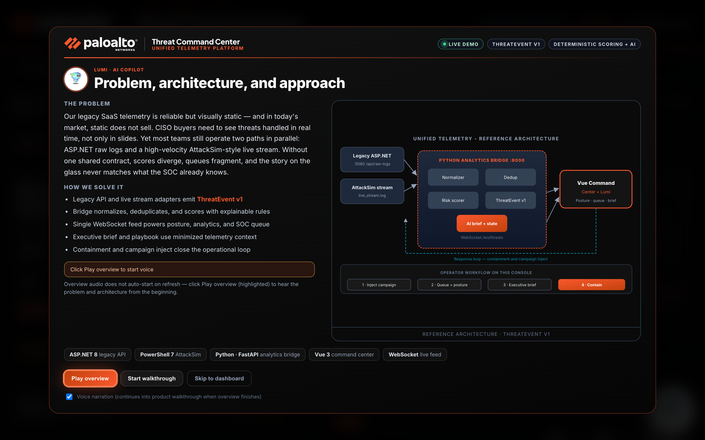</a>

#### 27-step voice walkthrough

Lumi spotlights every surface (shown: the Global attack map step), then runs inject → alarm → contain on its own.

<a href="docs/screenshots/features/02-guided-tour.png">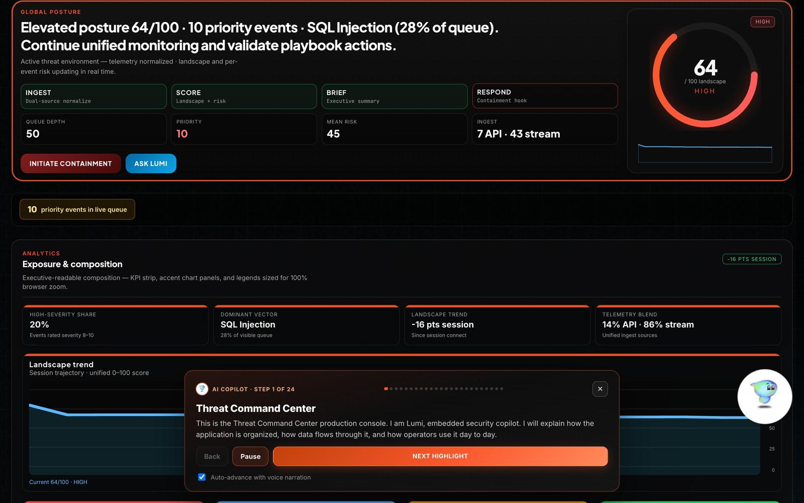</a>

#### Critical-zone alarm

Starts instantly when the landscape is critical: flashing strip, siren, timer, pulsing containment buttons, threat meter at 85/100.

<a href="docs/screenshots/features/03-critical-alarm.png">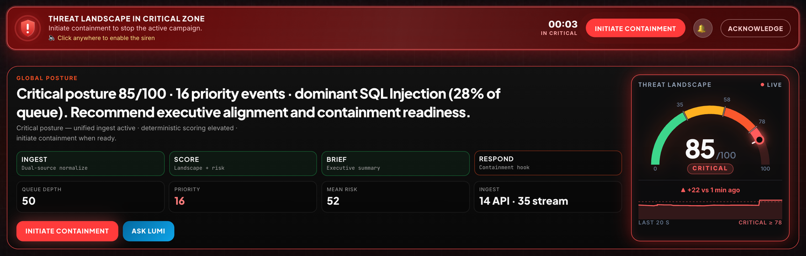</a>

#### 3D attack globe

Arcs fly to the region of the asset each event targeted (web tier in Oregon, legacy core in N. Virginia); protected regions, and top origins with their dominant ATT&CK technique.

<a href="docs/screenshots/features/04-attack-globe.png">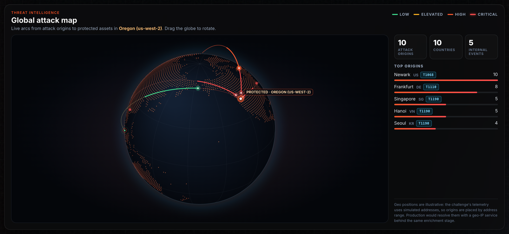</a>

#### Interactive analytics

Hover a donut slice: it pops out, the centre shows its share and count, and the caption adds the ATT&CK ID.

<a href="docs/screenshots/features/05-analytics-hover.png">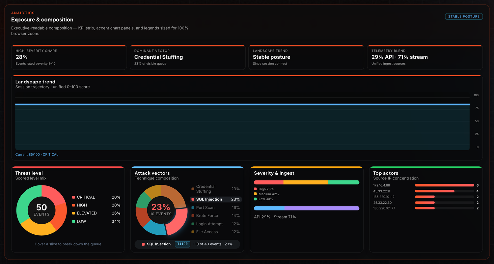</a>

#### Executive brief

CISO-ready summary quoting ATT&CK IDs; it always matches the gauge's posture.

<a href="docs/screenshots/features/07-executive-brief.png">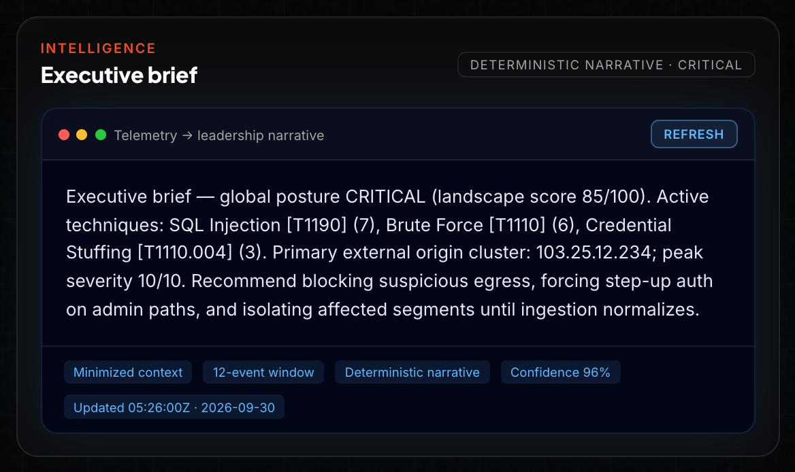</a>

#### Recommendations & playbook

A named playbook with a tactic-specific action (e.g. Initial Access → WAF virtual patching) and focal-event analysis.

<a href="docs/screenshots/features/08-playbook.png">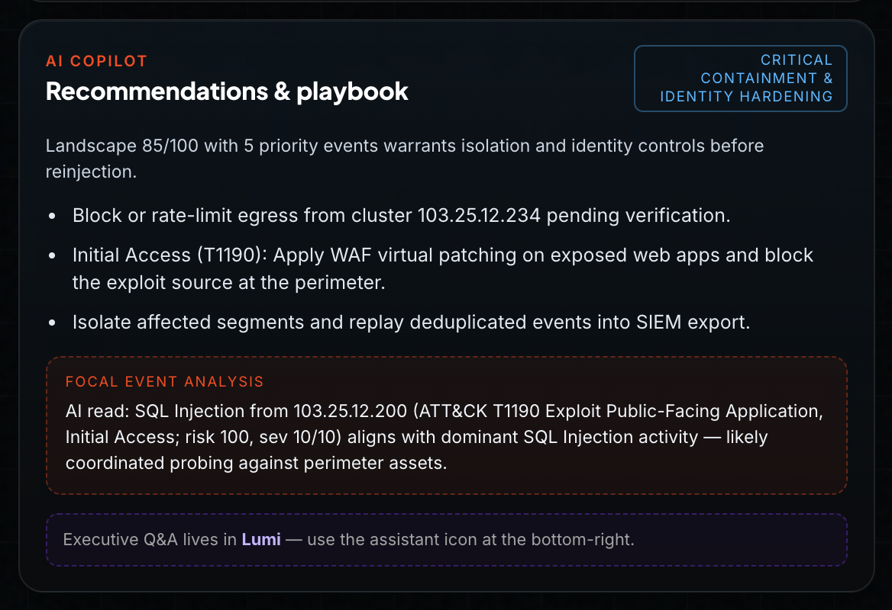</a>

#### Live threat queue + platform health

Both sources in one ThreatEvent v1.1 stream, each row tagged with its MITRE ATT&CK technique.

<p align="center"><a href="docs/screenshots/features/06-live-threat-queue.png">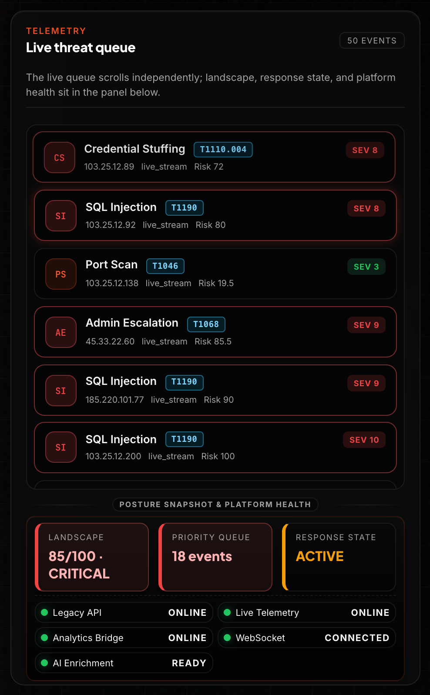</a></p>

#### Campaign injection

Scripted attack packs written to the real log, so they travel the real ingest path.

<p align="center"><a href="docs/screenshots/features/09-campaign-injection.png">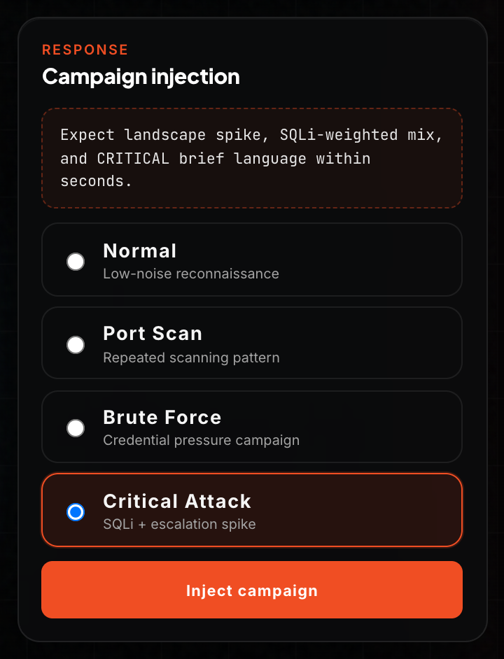</a></p>

#### After Contain

AttackSim stopped, status CONTAINED, the alarm cleared and the landscape decaying.

<a href="docs/screenshots/features/11-containment.png">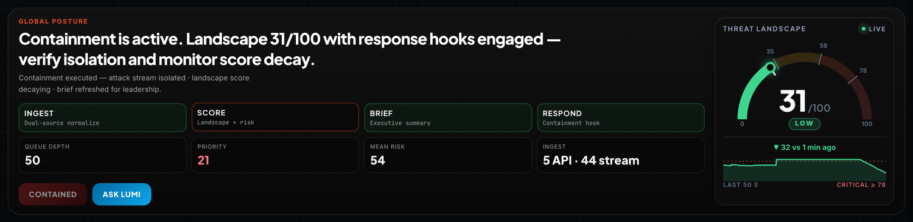</a>

#### Attack map after Contain

Arcs halted, with shield rings around the protected regions.

<a href="docs/screenshots/features/12-globe-contained.png">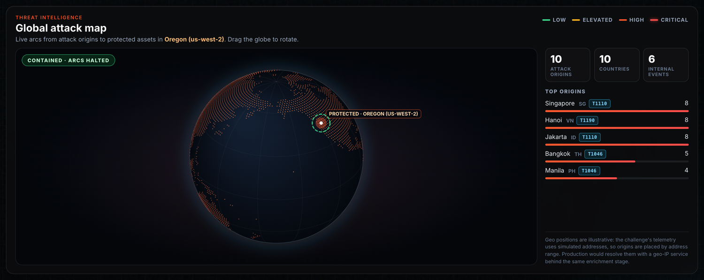</a>

#### Ask Lumi: executive Q&A

Free-form questions answered from current telemetry only (template or LLM).

<p align="center"><a href="docs/screenshots/features/10-ask-lumi.png">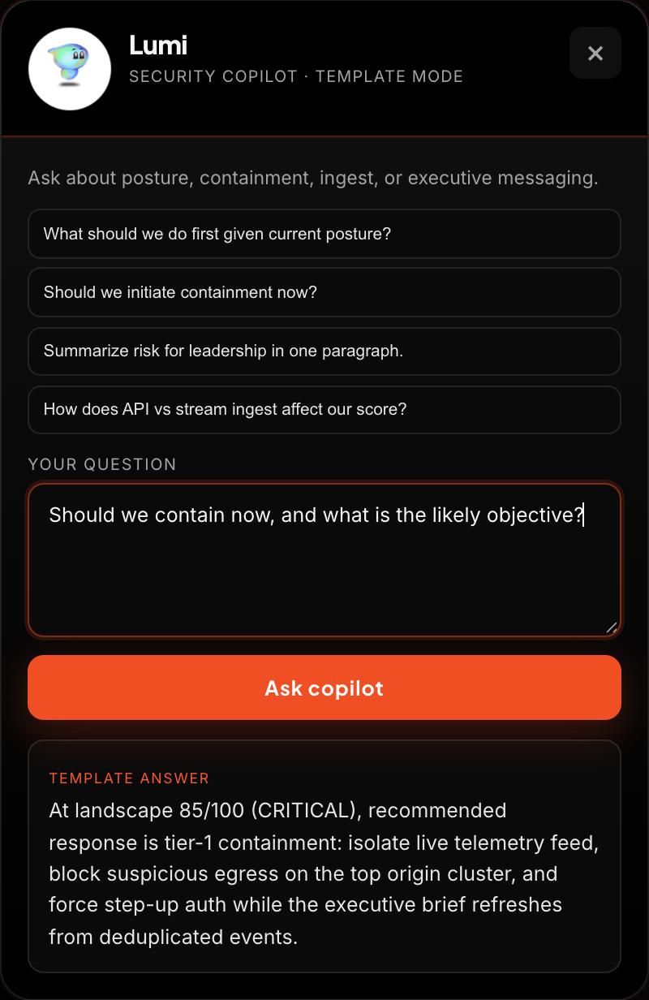</a></p>

---

## 4. Architecture

<a href="docs/architecture/architecture.svg">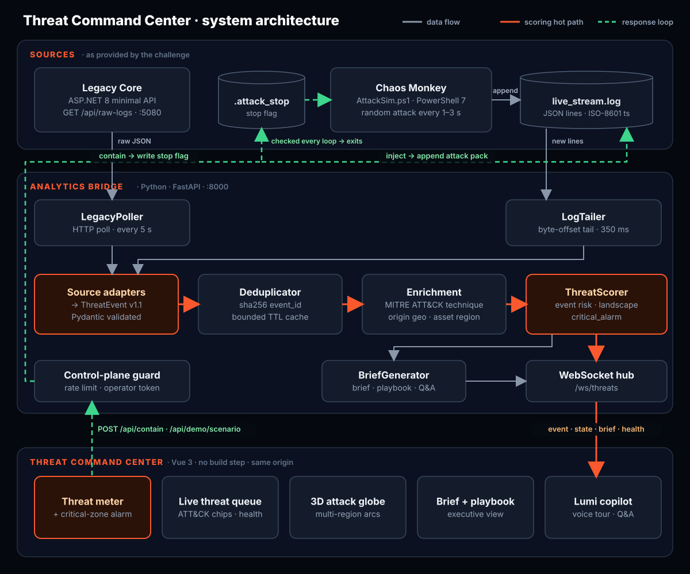</a>


### Inject → alarm → contain, step by step

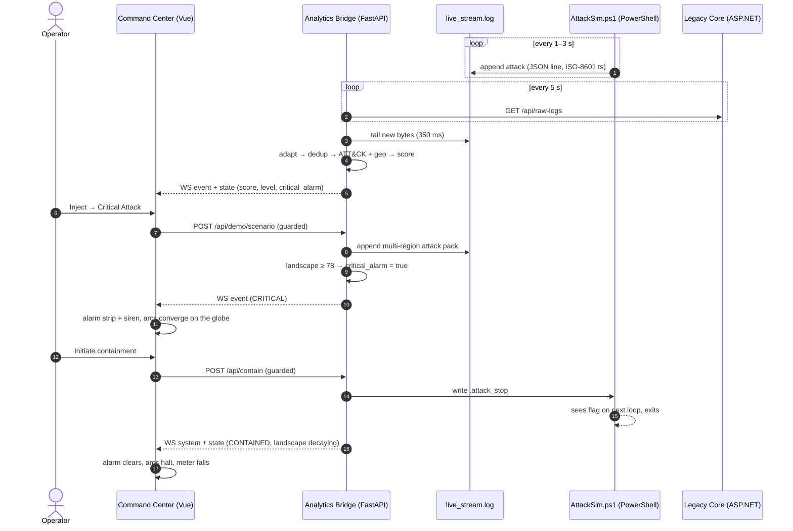

The in-product version of the topology:


### End-to-end data flow

1. **Produce.** `AttackSim.ps1` appends one compressed JSON object per line to `data/live_stream.log`. The legacy ASP.NET API serves its raw log array at `GET /api/raw-logs`.
2. **Ingest.** The bridge runs two concurrent asyncio loops:
   - `LogTailer` reads only the new bytes past its last file offset, every 350 ms.
   - `LegacyPoller` calls the legacy API every 5 s.
3. **Normalize.** Source-specific adapters (`live_entry_to_event`, `legacy_row_to_event`) map each raw shape to the canonical **`ThreatEvent`** model (contract v1.1). Pydantic validates it at this boundary.
4. **Dedupe.** Each event gets a deterministic `event_id` (a SHA-256 of source, timestamp, attack, IP, and destination). A bounded TTL cache drops repeats, which makes at-least-once ingestion safe.
5. **Enrich.** [`mitre.py`](bridge/mitre.py) tags each event with its MITRE ATT&CK technique (ID, name, tactic, reference URL), e.g. SQL Injection → **T1190** Exploit Public-Facing Application (Initial Access), the vocabulary SOC teams and XDR/XSIAM consoles use. [`geo.py`](bridge/geo.py) adds the origin location for the 3D attack map.
6. **Score.** `ThreatScorer` assigns a per-event `risk_score` (0–100) and `threat_level`, updates the time-decayed **global landscape score** that drives the gauge, and raises `critical_alarm` when the *landscape* is critical.
7. **Brief.** `BriefGenerator` refreshes the executive brief and playbook, quoting ATT&CK IDs and adding a tactic-specific response. It regenerates immediately on a posture change and is otherwise throttled to once every 20 s. It uses an LLM when one is configured and otherwise a deterministic template.
8. **Publish.** Everything is pushed to browsers over a single WebSocket (`/ws/threats`). Message types are `event`, `state`, `brief`, `health`, and `system`.
9. **Respond.** **Contain** calls `POST /api/contain`. The bridge writes `data/.attack_stop`, AttackSim sees the flag on its next loop and exits, and the landscape score decays over about 12 s.

**Adding a new telemetry source only means writing one adapter that emits `ThreatEvent`.** Scoring, the brief, and the UI stay the same.

### Ports

| Service | Port | Bound to |
|---------|------|----------|
| Legacy Logger (ASP.NET) | `5080` | `127.0.0.1` |
| Analytics Bridge + UI (FastAPI) | `8000` | `127.0.0.1` |

---

## 5. Component deep dive

### 5.1 Legacy Core — ASP.NET ([`legacy/Program.cs`](legacy/Program.cs))

The minimal API from the brief, kept as close to the original as possible:

- **Same default response.** The same three records (`Login Attempt` / `SSH Connection` / `File Access`) with the same PascalCase fields `Timestamp`, `Source`, `Event`, and `Status`.
- **Bound to `127.0.0.1:5080`**, with a CORS policy limited to the bridge origin.
- **Optional `?jitter=true`.** This randomizes the first record's source, event, and status so the legacy feed keeps producing *new* events during a long demo instead of the same three rows. The bridge turns jitter on only after its first bootstrap poll.

### 5.2 Chaos Monkey — PowerShell ([`chaos/AttackSim.ps1`](chaos/AttackSim.ps1))

Same attack generator as the brief (Brute Force / SQL Injection / Port Scan / Credential Stuffing, severity 1–9, origin `103.25.12.x`, 1–3 s cadence), with three demo-critical changes:

| Change | Why |
|--------|-----|
| Writes to `<repo>/data/live_stream.log`, resolved from the script's own location | Works no matter which directory it is launched from |
| `Add-Content -Encoding utf8` instead of `Out-File -Append` | Windows PowerShell 5.1's `Out-File` defaults to UTF-16LE, which breaks naive line readers |
| Checks for `data/.attack_stop` on every iteration and exits cleanly | Lets the dashboard's **Contain** button genuinely stop the attack (the "Mitigate" example from the brief) |

### 5.3 Analytics Bridge — Python ([`bridge/`](bridge/))

| Module | Responsibility |
|--------|----------------|
| [`main.py`](bridge/main.py) | FastAPI app, background ingest loops, ingest pipeline, REST + WebSocket endpoints, static hosting of the dashboard |
| [`ingest.py`](bridge/ingest.py) | `LogTailer` (offset-based tail; tolerant parser that pulls JSON objects out of partial or concatenated writes) and `LegacyPoller` (HTTP poll + bootstrap/jitter handling), plus the two source adapters |
| [`models.py`](bridge/models.py) | Pydantic models: `ThreatEvent`, `ScoredEvent`, `ThreatState`, `SystemHealth`, `AiInsights`, request/response DTOs |
| [`dedup.py`](bridge/dedup.py) | Deterministic `event_id` + bounded, TTL-evicting `EventDeduplicator` (2 000 entries / 1 h) |
| [`mitre.py`](bridge/mitre.py) | MITRE ATT&CK enrichment stage: attack type → technique ID, name, tactic, URL; tactic-specific response guidance for the playbook |
| [`geo.py`](bridge/geo.py) | Origin geolocation enrichment for the attack map: address range → location (illustrative for the simulated IPs), internal-network detection, and the protected target from the tenant region |
| [`scorer.py`](bridge/scorer.py) | Per-event risk scoring, the time-decayed global landscape score, and the `critical_alarm` signal (see [§7](#7-scoring-model)) |
| [`guard.py`](bridge/guard.py) | Control-plane guard on state-changing endpoints: per-client rate limit and an optional operator token |
| [`brief.py`](bridge/brief.py) | Executive brief, playbook, recommendations, and executive Q&A. Uses the OpenAI Chat Completions API when a key is set and a deterministic template otherwise |
| [`health.py`](bridge/health.py) | Per-component health: Legacy API, Live Telemetry, Analytics Bridge, WebSocket, AI Enrichment |
| [`scenario.py`](bridge/scenario.py) | Scripted attack packs (`normal`, `port_scan`, `brute_force`, `critical`) appended to the same log file, so injected events travel the **real** ingest path |
| [`narration.py`](bridge/narration.py), [`narration_scripts.py`](bridge/narration_scripts.py) | Lumi copilot copy + neural TTS (Microsoft Edge `en-US-JennyNeural`) with an on-disk MP3 cache |

### 5.4 Command Center — HTML5/JS ([`dashboard/`](dashboard/))

- **Vue 3 as a native ES module.** The runtime is vendored in `dashboard/vendor/`, so there is **no npm, no bundler, and no build step**. The bridge serves the UI from the same origin.
- **Four workspaces**, switchable with keyboard shortcuts `1`–`4`:
  - **Posture:** global gauge, headline, KPIs, analytics tiles.
  - **Telemetry:** live SOC queue with per-source health.
  - **Intelligence:** executive brief, playbook, recommendations.
  - **Response:** inject scenarios and contain.
- **Threat landscape meter:** a semicircle with the real zone thresholds (LOW / ELEVATED 35 / HIGH 58 / CRITICAL 78), a needle on the live score, a 60 s change indicator and a labelled 2-minute trend.
- **Critical-zone alarm:** the moment the landscape is critical, a flashing alarm strip, a continuous siren, pulsing containment buttons and a `⚠ CRITICAL` tab title. **Acknowledge** snoozes it for 15 s; **Contain** ends it (see [§8](#8-the-sales-edge-features)).
- **Interactive analytics:** hover or tap the Threat level and Attack vectors donuts for per-slice share, count and ATT&CK ID.
- **MITRE ATT&CK chips** on every queue row, linking to the technique on attack.mitre.org.
- **3D attack globe** ([`attack-globe.mjs`](dashboard/attack-globe.mjs)): a dot-matrix Earth drawn with Canvas 2D (no libraries) with live attack arcs to the protected region, plus a top-origins leaderboard (see [§8](#8-the-sales-edge-features)).
- **Floating action dock** with **Inject**, **Brief**, and **Contain**, always one click away during a demo.
- **Auto-reconnecting WebSocket.** After a reconnect the UI rehydrates from `GET /api/state`.
- **Export Summary.** Downloads a posture and brief snapshot to hand to leadership.
- **Theming** lives in `themes.css`, `styles.css`, `world-ui.css`, `leadership-layout.css`, and `motion.css`: Palo Alto orange accents, glow and pulse on critical states, and reduced-motion–friendly transitions.

---

## 6. The ThreatEvent v1 contract

Every source is normalized to this shape before anything downstream sees it ([`bridge/models.py`](bridge/models.py)):

| Field | Type | Description |
|-------|------|-------------|
| `schema_version` | `str` | Contract version (`"1.1"`; 1.1 added the optional `technique`, backward compatible) |
| `event_id` | `str` | Deterministic `evt-<sha256[:12]>` of source + timestamp + attack + IP + destination |
| `timestamp` | `datetime` | Event time (UTC) |
| `source` | enum | `legacy_api` \| `live_stream` \| `soc_console` |
| `attack_type` | `str` | Technique or legacy event name |
| `source_ip` | `str` | Origin |
| `destination` | `str` | Target asset (`web-app-01`, `legacy-saas-core`, …) |
| `status` | `str` | `Detected`, `Failed`, `Denied`, `Blocked`, `Contained`, … |
| `raw_severity` | `int` 1–10 | Upstream severity (validated range) |
| `metadata` | `dict` | Original raw payload + upstream tag (non-authoritative) |
| `technique` | `object \| null` | MITRE ATT&CK technique added by the enrichment stage: `id`, `name`, `tactic`, `url` |
| `geo` | `object \| null` | Origin location added by the enrichment stage: `city`, `country`, `lat`, `lon`, `internal`, `illustrative` |

After scoring, clients also receive `risk_score` (0–100), `threat_level`, `global_score`, and `global_threat_level`.

### Source mapping

| Raw field | Live stream (PowerShell) | Legacy API (C#) |
|-----------|--------------------------|-----------------|
| `attack_type` | `type` | `Event` |
| `source_ip` | `origin` | `Source` |
| `timestamp` | `ts` (full ISO-8601 UTC); falls back to the original `time` (`HH:mm:ss`) | `Timestamp` (ISO-8601) |
| `status` | `"Detected"` | `Status` |
| `raw_severity` | `severity` (clamped 1–10) | derived: `6` if Failed/Denied/Blocked, else `4` |
| `destination` | `web-app-01` | `legacy-saas-core` |

### Example (as broadcast on the WebSocket)

```json
{
  "type": "event",
  "payload": {
    "event": {
      "schema_version": "1.1",
      "event_id": "evt-8f21a2c91b4d",
      "timestamp": "2026-09-29T16:44:32Z",
      "source": "live_stream",
      "attack_type": "SQL Injection",
      "source_ip": "103.25.12.200",
      "destination": "web-app-01",
      "status": "Detected",
      "raw_severity": 9,
      "metadata": { "upstream": "live_stream.log" },
      "technique": {
        "id": "T1190",
        "name": "Exploit Public-Facing Application",
        "tactic": "Initial Access",
        "url": "https://attack.mitre.org/techniques/T1190/"
      },
      "geo": { "city": "Hanoi", "country": "VN", "lat": 21.03, "lon": 105.85, "internal": false, "illustrative": true }
    },
    "risk_score": 90.0,
    "threat_level": "CRITICAL",
    "global_score": 81.4,
    "global_threat_level": "CRITICAL",
    "critical_alarm": true
  }
}
```

---

## 7. Scoring model

Scoring is **deterministic and explainable**, so a CISO can ask "why is this red?" and get a real answer. AI is used for the narrative, never for the detection path.

### 7.1 Per-event `risk_score` (0–100)

```
risk = attack_weight × (raw_severity / 10) × 100
     + 15   if status ∈ {Failed, Denied, Blocked}
clamped to [0, 100]
```

| Attack type | Weight | | Attack type | Weight |
|-------------|--------|-|-------------|--------|
| SQL Injection | 1.00 | | SSH Connection | 0.75 |
| Admin Escalation | 0.95 | | File Access | 0.70 |
| Credential Stuffing | 0.90 | | Port Scan | 0.65 |
| Brute Force | 0.85 | | Login Attempt | 0.55 |
| DNS Query | 0.40 | | *unknown* | 0.50 |

**Event level:** `CRITICAL` if severity ≥ 9 or risk ≥ 90 · `HIGH` if severity ≥ 7 or risk ≥ 72 · `ELEVATED` if risk ≥ 42 · otherwise `LOW`.

### 7.2 Global landscape score (the gauge)

One critical hit from ten minutes ago should **not** pin the gauge red forever. The landscape score is computed over a sliding 120 s window:

| Component | Formula |
|-----------|---------|
| Recency-weighted mean | each event weighted by `exp(-age / 45s)`, plus 2 quiet pseudo-events at risk 0, so sparse evidence (one stray legacy `Failed` login) can't read as HIGH on its own |
| Diversity bonus | `+3` per unique technique, max `+12` |
| Frequency bonus | `+1.5` per event in the last 60 s, max `+12` |
| Peak floor | if any event in the last 30 s has risk ≥ 85, score ≥ `0.85 × peak` |
| Severity flash | a severity ≥ 9 hit holds the score at ≥ 80 (**CRITICAL**, red) for 4 s, so the gauge visibly turns red on each high-severity AttackSim hit and then falls back. On a live stream that is about 3 red flashes a minute, red roughly a quarter of the time |
| Containment | events observed before **Contain** fade out linearly over 12 s and then stop counting, so the gauge can't rebound to CRITICAL from an attack that was already contained. New activity after Contain (e.g. a fresh inject) counts normally |

**Gauge level:** `CRITICAL` ≥ 78 · `HIGH` ≥ 58 · `ELEVATED` ≥ 35 · `LOW` < 35.

This is why a single severity-9 SQL Injection flips the gauge red immediately (the peak floor), and why it relaxes on its own once the attack stops (the decay).

### 7.3 Critical alarm (`critical_alarm`)

Two different things can make the gauge CRITICAL, and only one should sound a siren:

| Situation | Gauge | `critical_alarm` |
|-----------|-------|------------------|
| A single severity-9 AttackSim hit (the 4 s severity flash) | red, then falls back | `false`: a hit, not a campaign |
| The landscape itself ≥ 78 (e.g. an injected campaign) | CRITICAL | `true`, on the very next update |

The bridge computes the landscape a second time **without** the severity flash; the alarm is raised when that score is still ≥ 78. Over 10 simulated minutes of AttackSim traffic the gauge is red about a quarter of the time with **zero** false alarms, while an Inject raises the alarm in under 100 ms.

---

## 8. The "Sales Edge" features

The brief asked for **one** jaw-drop feature. This build covers all three suggested examples and adds a fourth:

### 🧠 AI Threat Brief + Playbook (the "AI Summary")
- A 3–4 sentence CISO-grade summary of the current campaign, plus a named **playbook** with three recommendations and a confidence score.
- **With `OPENAI_API_KEY`:** the brief comes from `gpt-4o-mini` (configurable). The model sees a **minimized** context of only the last 12 events, reduced to `attack|ip|severity|risk|level`, with no raw payloads.
- **Without a key:** a deterministic template produces the same structure from the same data, so the demo never breaks on Wi-Fi or quota issues.
- Always quotes the same posture as the gauge. A level change (e.g. HIGH → CRITICAL, or decay after Contain) regenerates it immediately. Otherwise refreshes are throttled to one every 20 s, and **Refresh Brief** forces one on demand.

### 🛑 Contain (the "Mitigate button that stops the PowerShell script")
- `POST /api/contain` writes `data/.attack_stop`. AttackSim checks for the file on every iteration and **exits**.
- The bridge adds a `CONTAINMENT` event to the feed, marks the stream **STOPPED**, decays the landscape score, and forces a fresh brief.
- **Inject** clears the flag again, so the demo can loop: inject → critical → contain → inject.

### 🚨 Critical-zone alarm
- Starts the moment `critical_alarm` is raised: a flashing strip ("Threat landscape in CRITICAL zone"), a timer, a shield-alert icon, pulsing **Initiate containment** buttons, a red-glowing posture panel and a `⚠ CRITICAL` browser-tab title.
- A synthesized emergency-wail siren (WebAudio, no audio file) plays continuously. **Acknowledge** snoozes it for 15 s, after which it re-arms if the threat is still active; **Contain** stops everything. 🔔 mutes it, and it pauses while Lumi is speaking. Browsers require one click on the page before any audio can play.

### 🌐 3D attack globe (the "3D map visualization")
- A rotating dot-matrix Earth (Natural Earth land mask, pre-computed by [`scripts/generate_land_dots.py`](scripts/generate_land_dots.py) into a 36 KB file shipped with the app) rendered with an orthographic projection on Canvas 2D. No WebGL or libraries, 60 fps.
- **Multi-region, driven by real event data:** each protected asset lives in a region (`TCC_ASSET_REGIONS`, default: the modern web tier `web-app-01` in **us-west-2 · Oregon**, the legacy ASP.NET core `legacy-saas-core` in **us-east-1 · N. Virginia**, its original datacenter). Every event's arc flies from its origin to the region of the asset it actually targeted, coloured by threat level, with an origin pulse and an impact ripple. Internal (LAN) activity pulses at that region instead. **Contain** fades the arcs and draws shield rings.
- The Critical campaign converges from three continents (Asia-Pacific, Frankfurt, Newark). The globe rotates slowly so every region comes into view and **swings to face each critical arc** before resuming; drag to rotate by hand. The render loop pauses off-screen and in background tabs, and respects reduced motion.
- The side panel lists **protected regions** with their assets and event counts, plus top origins with each origin's dominant ATT&CK technique.
- A side panel shows attack origins, countries, internal events and a top-origins leaderboard.
- **Honest by design:** the challenge's telemetry uses *simulated* addresses, so origins are placed by address range (APNIC 103.x → Asia-Pacific cities, 185.220.101.x → Frankfurt, …) and the UI labels positions as illustrative. A geo-IP service would plug into the same enrichment stage.

### 🧭 MITRE ATT&CK mapping
- Every event carries its ATT&CK technique; the queue shows it as a chip linking to attack.mitre.org, the brief quotes IDs ("SQL Injection [T1190]"), and the playbook adds a response matched to the dominant **tactic** (e.g. Initial Access → WAF virtual patching; Credential Access → MFA and lockout).

### 🤖 Lumi — AI Copilot guide with voice
- On load, an intro modal presents the problem statement, how it's solved, and the reference architecture diagram.
- **Play overview** narrates the full overview (problem statement, then approach) from 0:00. Nothing auto-plays on page load, so browser autoplay rules never cut in mid-sentence. **Replay overview** stops everything, including a running tour, and restarts from the beginning.
- **Start walkthrough** runs a 27-step spotlighted, neural-voice tour of the whole console, including the **threat landscape meter**, the **global attack map** (regions, arcs, ATT&CK per origin), **ATT&CK chips** in the queue and the interactive donuts. The copilot then runs the operational flow itself: it injects a campaign, narrates the **critical-zone alarm** and the arcs converging on the map, refreshes the brief, and initiates containment. The guide bar offers **Pause** / **Read aloud** / **Back** / **Next highlight**.
- Each intro or tour run carries a token, so delayed continuations (auto-advance timers, step actions, audio callbacks) from an abandoned run can never talk over a newer one.
- The voice clips are **pre-generated and committed** (`dashboard/assets/narration/`), so narration works offline. A clip is only used if its digest matches the current script text. Otherwise the bridge generates it live via `edge-tts` and caches it, so an edited script never plays a stale clip.

### 💬 Ask Lumi — executive Q&A
- A CISO can type a free-form question ("Should we isolate the web tier?") and get a 2–3 sentence answer grounded **only** in current telemetry. It uses the LLM when one is configured and a template otherwise.

---

## 9. API reference

All endpoints are served by the bridge on `http://127.0.0.1:8000`. Interactive OpenAPI docs are at **`/docs`**.

| Method | Path | Purpose |
|--------|------|---------|
| `GET` | `/` | Command Center UI |
| `WS` | `/ws/threats` | Live push: `event`, `state`, `brief`, `health`, `system` messages. Sends a full `state` + `brief` on connect |
| `GET` | `/api/state` | Full snapshot: global score/level, `critical_alarm`, recent scored events, containment status, health |
| `GET` | `/api/health` | Per-component health |
| `GET` | `/api/brief` | Current executive brief (text + mode + insights) |
| `GET` | `/api/ai/insights` | Playbook, recommendations, confidence, focal insight |
| `POST` | `/api/ai/brief/regenerate` | Force a brief refresh |
| `POST` | `/api/ai/ask` | Executive Q&A — body `{"question": "..."}` |
| `POST` | `/api/demo/scenario` | Inject an attack pack — body `{"scenario": "normal" \| "port_scan" \| "brute_force" \| "critical"}` |
| `POST` | `/api/contain` | Containment: stop AttackSim, decay landscape |
| `POST` | `/api/mitigate` | Alias of `/api/contain` (matches the brief's wording) |
| `GET` | `/api/platform` | Console metadata (env, region, tenant, version) |
| `GET` | `/api/narration/intro`, `/api/narration/tour` | Lumi narration scripts |
| `POST` | `/api/narration/speak` | Text → cached neural-voice MP3 |

State-changing endpoints (`/api/contain`, `/api/mitigate`, `/api/demo/scenario`, `/api/ai/ask`, `/api/ai/brief/regenerate`, `/api/narration/speak`) go through the control-plane guard: over the per-client rate limit they return **429** with `Retry-After`, and when `CONTROL_TOKEN` is set they require an `X-Control-Token` header (**401** otherwise). The dashboard only updates on success and tells the operator when an action is refused.

### Try it from the terminal

```bash
# Current posture
curl -s http://127.0.0.1:8000/api/state | python3 -m json.tool | head -20

# Push the gauge to CRITICAL
curl -s -X POST http://127.0.0.1:8000/api/demo/scenario \
  -H 'content-type: application/json' -d '{"scenario":"critical"}'

# Contain — AttackSim prints "Stop flag detected — attack simulation halted."
curl -s -X POST http://127.0.0.1:8000/api/contain

# Ask the copilot
curl -s -X POST http://127.0.0.1:8000/api/ai/ask \
  -H 'content-type: application/json' -d '{"question":"What should we do now?"}'
```

---

## 10. Configuration

Copy `.env.example` to `.env` (it is git-ignored). `start-demo.sh` loads it automatically.

| Variable | Default | Description |
|----------|---------|-------------|
| `OPENAI_API_KEY` | *(empty)* | Enables LLM brief, recommendations, and Q&A. Leave empty for template mode |
| `OPENAI_MODEL` | `gpt-4o-mini` | Chat model used for enrichment |
| `LLM_BRIEF_ENABLED` | `true` | Kill-switch for LLM calls even when a key is present |
| `LEGACY_API_URL` | `http://127.0.0.1:5080` | Where the bridge polls the legacy API |
| `DATA_DIR` | `<repo>/data` | Location of `live_stream.log`, the stop flag, and the narration cache |
| `DASHBOARD_DIR` | `<repo>/dashboard` | Static UI directory served by the bridge |
| `EDGE_TTS_VOICE` | `en-US-JennyNeural` | Voice for Lumi narration |
| `CONTROL_RATE_LIMIT` | `30/60` | Control actions allowed per client per window (`20/60` on the public URL); `off` disables |
| `CONTROL_TOKEN` | *(empty)* | When set, control actions require the `X-Control-Token` header |
| `TCC_REGION` | `us-west-2` | Tenant's primary region (header, exports, attack-map default target) |
| `TCC_ASSET_REGIONS` | `web-app-01=us-west-2,legacy-saas-core=us-east-1` | Which region each protected asset (event `destination`) runs in; drives the attack-map targets. Supported: `us-west-2`, `us-east-1`, `eu-west-1`, `ap-southeast-1` |
| `DEPLOY_ENV`, `TCC_TENANT`, `TCC_VERSION`, `TCC_BUILD` | `enterprise`, `primary`, `1.0.0`, `release` | Cosmetic console metadata shown in the header / exports |

### Running components individually

```bash
# 1. Legacy Core
cd legacy && dotnet run --urls http://127.0.0.1:5080

# 2. Analytics Bridge
cd bridge && python3 -m venv .venv && .venv/bin/pip install -r requirements.txt
DATA_DIR=../data LEGACY_API_URL=http://127.0.0.1:5080 .venv/bin/uvicorn main:app --port 8000

# 3. Chaos Monkey
pwsh -File chaos/AttackSim.ps1
```

### Docker Compose (optional)

A `docker-compose.yml` with `legacy`, `bridge`, and `chaos` services is included (`docker compose up`, then open http://127.0.0.1:8000). The legacy API binds to loopback by default and honors `--urls` / `ASPNETCORE_URLS`, which Compose uses to bind `0.0.0.0`. `./scripts/start-demo.sh` remains the primary, end-to-end-tested path.

### Hosted demo (single container)

[`deploy/Dockerfile`](deploy/Dockerfile) packages all three components into one image: the published ASP.NET API, the Python bridge (which serves the UI), and PowerShell running `AttackSim.ps1`. [`deploy/entrypoint.sh`](deploy/entrypoint.sh) starts them together. A supervisor restarts AttackSim after an Inject clears containment, and `DEMO_AUTO_RESUME_SECONDS` lets a shared public demo un-contain itself so it is never frozen for the next visitor.

[`render.yaml`](render.yaml) deploys it as a free Render web service (WebSockets supported): **Render → New → Blueprint → select this repo**. The public service runs the AI in template mode (`LLM_BRIEF_ENABLED=false`), so nobody on the internet can spend an API key. Free instances sleep when idle. A scheduled workflow ([`.github/workflows/keepalive.yml`](.github/workflows/keepalive.yml)) pings the service every 10 minutes to keep it warm, but GitHub may delay scheduled runs, so a cold start of about a minute is still possible.

CI ([`.github/workflows/ci.yml`](.github/workflows/ci.yml)) runs the test suite and builds this image on every push. It then drives the real flow through the running container: both sources ONLINE → inject → CRITICAL → Contain halts AttackSim → Inject restarts it.

---

## 11. Resilience & graceful degradation

| Failure | Behavior |
|---------|----------|
| Legacy API down | Legacy health → **DEGRADED**; the live stream keeps flowing |
| AttackSim stopped / contained | Stream → **STOPPED**; history and brief remain |
| Partial / concatenated log writes | Tolerant regex parser recovers every complete JSON object |
| Duplicate events (poll + tail) | Dropped by deterministic `event_id` + TTL cache |
| WebSocket drop | Client auto-reconnects and rehydrates from `/api/state` |
| LLM unavailable, slow, or no key | Silent fallback to the template brief. Detection is unaffected |
| Browser blocks autoplay audio | Lumi shows a "Play overview" prompt; the tour still works silently |
| CDN blocked | Vue is vendored locally |

---

## 12. Security considerations

- **No secrets in the repo.** `.env` is git-ignored; `.env.example` holds placeholders only.
- **Validation at the boundary.** Every upstream payload passes through Pydantic (`raw_severity` is range-checked, types are coerced) before scoring.
- **Fixed filesystem paths.** The log, stop flag, and cache live under `DATA_DIR`, and no request can supply a path.
- **Loopback only.** Both services bind to `127.0.0.1`. The UI is same-origin with the bridge, and legacy CORS is restricted to the bridge origin.
- **Data minimization for the LLM.** Only the last 12 normalized events, reduced to type (with its ATT&CK ID), IP, severity, risk, and level, are sent. Raw payloads and metadata are never sent.
- **XSS-safe rendering.** Vue text bindings escape by default.
- **Control-plane guard.** Inject / Contain / AI / text-to-speech are rate-limited per client (real client IP behind the proxy), with an optional operator token compared in constant time. The public demo stays clickable but can't be hammered.
- **Containment is a demo control.** It writes a local stop flag and is not production enforcement. In production this hook would call a firewall or EDR API (e.g. PAN-OS / Cortex XSOAR).

---

## 13. Key design decisions

| Decision | Rationale |
|----------|-----------|
| **Python bridge as the "adapter layer"** | Legacy and modern sources speak different shapes. One place normalizes them into a versioned contract |
| **Canonical `ThreatEvent` v1** | Decouples producers from consumers. New integrations don't touch scoring or UI |
| **Deterministic scoring, AI only for narrative** | Explainable, demo-reliable, zero runtime dependency on an LLM for detection |
| **Separate event risk vs. global landscape** | The per-event score answers "how bad is this hit?"; the landscape answers "how bad is *right now*?" |
| **File tail by byte offset** (not re-reading) | O(new bytes), works with any appending producer |
| **At-least-once + dedup** | Poll + tail can overlap. Idempotent IDs make that harmless |
| **WebSocket push** | Threats are a stream, so polling would add latency and load |
| **Stop-flag file for containment** | The simplest cross-language, cross-process control channel. Nothing needs to be installed in PowerShell |
| **Scenario injection through the real log file** | Demo buttons exercise the exact same ingest path as the attacker |
| **Vue 3 ESM with no build step** | Reviewers can read the code as shipped, and `git clone` → run works without Node |

---

## 14. How AI tools were used ("The Vibe")

The challenge rewards **velocity over artisan loops**. The work was split deliberately:

| Delegated to AI (Cursor + Claude / LLM pair-programming) | Owned by me (architecture & judgment) |
|----------------------------------------------------------|----------------------------------------|
| FastAPI scaffold, Pydantic models, endpoint boilerplate | The `ThreatEvent` v1 contract and source mappings |
| Vue 3 component shell, CSS theming, animations | The scoring formula, landscape decay, and thresholds |
| Lumi narration copy and tour step text | Dedup strategy and deterministic IDs |
| `start-demo.sh`, Dockerfiles, Apple Silicon venv repair | Security boundaries (LLM data minimization, fixed paths, loopback binds) |
| README drafting and diagrams | Closed-loop containment design (stop flag ↔ PowerShell) and the demo narrative |

The result is a demo that looks like a shipped product, with its architecture decisions written down and defensible.

---

## 15. Repository layout

```
frankenstein-threat-command-center/
├── legacy/                  # Legacy Core — ASP.NET 8 minimal API
│   ├── Program.cs           #   GET /api/raw-logs (+ optional ?jitter=true)
│   ├── LegacyLogger.csproj
│   └── Dockerfile
├── chaos/
│   └── AttackSim.ps1        # Chaos Monkey — writes data/live_stream.log, honors stop flag
├── bridge/                  # Analytics Bridge — Python / FastAPI
│   ├── main.py              #   app, pipeline, REST + WebSocket, static hosting
│   ├── ingest.py            #   LogTailer, LegacyPoller, source adapters
│   ├── models.py            #   ThreatEvent v1 + DTOs
│   ├── dedup.py             #   deterministic IDs + TTL dedup cache
│   ├── scorer.py            #   event risk + global landscape scoring
│   ├── brief.py             #   AI / template brief, playbook, Q&A
│   ├── health.py            #   per-component health
│   ├── scenario.py          #   demo attack packs
│   ├── narration.py         #   neural TTS + cache
│   ├── narration_scripts.py #   Lumi intro + tour copy
│   ├── requirements.txt
│   └── Dockerfile
├── dashboard/               # Command Center — Vue 3 ESM, no build step
│   ├── index.html
│   ├── app.mjs              #   UI, WebSocket client, tour, copilot
│   ├── narration.mjs        #   audio playback / autoplay handling
│   ├── attack-globe.mjs     #   3D attack globe (Canvas 2D, no libraries)
│   ├── architecture-diagram.mjs
│   ├── *.css                #   themes, layout, motion
│   ├── vendor/vue.esm-browser.js
│   └── assets/              #   logos, architecture SVG, Lumi, narration MP3s, geo/land-dots.json
├── tests/                   # pytest: scorer, dedup, adapters, API end to end
├── deploy/                  # all-in-one Dockerfile + entrypoint for hosted demos (render.yaml at root)
├── scripts/
│   ├── start-demo.sh        # one-command local demo
│   ├── generate_land_dots.py # Natural Earth land mask -> globe dots
│   ├── generate-narration.sh
│   └── generate_narration.py
├── data/                    # runtime: live_stream.log, .attack_stop (git-ignored)
├── docs/architecture/       # architecture.svg + its generator (diagram as code)
├── docs/screenshots/
├── docker-compose.yml
└── .env.example
```

---

## 16. Tests

A `pytest` suite (58 tests, about 1.5 s) plus a browser smoke test covers the parts that carry the architecture:

| File | What it proves |
|------|----------------|
| [`tests/test_scorer.py`](tests/test_scorer.py) | Attack weights × severity, the +15 Failed/Denied/Blocked bump and cap, event-level thresholds, one critical hit flips the gauge CRITICAL, low noise stays LOW, containment decays the landscape and a contained attack can't rebound after the window, a single noisy event stays LOW, a severity-9 hit flashes CRITICAL and falls back (but not once contained) |
| [`tests/test_brief.py`](tests/test_brief.py) | A posture change regenerates the brief even inside the throttle window, so brief and gauge never disagree; `updated_at` is the real generation time; the console's own CONTAINMENT marker is never reported as an attack technique |
| [`tests/test_dedup.py`](tests/test_dedup.py) | Deterministic, field-sensitive `event_id`s; a repeated observation is dropped; the cache is bounded |
| [`tests/test_ingest.py`](tests/test_ingest.py) | JSON-lines, concatenated, and truncated log writes; PowerShell and ASP.NET payloads both map to `ThreatEvent` v1; severity clamping and defaults |
| [`tests/test_api.py`](tests/test_api.py) | End to end through FastAPI: inject → real log-tail ingest → CRITICAL → contain writes the AttackSim stop flag; `/api/mitigate` alias; invalid scenarios rejected; template brief without an LLM |
| [`tests/test_geo.py`](tests/test_geo.py) | Every scenario origin gets a valid location; AttackSim's range lands in Asia-Pacific deterministically; RFC 1918 / loopback are internal while RFC 5737 documentation ranges are external attackers; assets map to their regions (unknown → primary) and protected regions list primary first |
| [`tests/test_mitre.py`](tests/test_mitre.py) | Every attack type AttackSim, the legacy API and the scenario packs can emit maps to a well-formed ATT&CK technique; enrichment tags events and leaves unknown types alone |
| [`tests/test_guard.py`](tests/test_guard.py) | Per-client rate limit returns 429 with `Retry-After`; clients don't share quotas; `X-Forwarded-For` resolves the real client; the optional token returns 401 without it |
| [`tests/test_properties.py`](tests/test_properties.py) | Property-based (Hypothesis), over random events and streams: risk always 0–100, higher severity never lowers risk or level, the landscape stays in range, and `critical_alarm` always implies CRITICAL |
| [`tests/test_ws_contract.py`](tests/test_ws_contract.py) | The real `/ws/threats` channel: `state` then `brief` on connect, and `event` messages carrying every field the dashboard relies on, including `technique` and `critical_alarm` |
| [`tests/e2e/test_ui_smoke.py`](tests/e2e/test_ui_smoke.py) | Playwright in Chromium against the running stack: branded intro → Skip → Inject Critical Attack through the real buttons → gauge CRITICAL, alarm strip, tab title, globe arcs + origin leaderboard, ATT&CK chip → Contain → alarm cleared, map "Contained", no console errors. Runs in CI against the container |
| [`tests/test_assets.py`](tests/test_assets.py) | No text file in the repo contains U+FFFD replacement characters (an encoding round-trip once replaced the diagram's `·` and `—` with them) |

```bash
python3 -m venv .venv-test
.venv-test/bin/pip install -r bridge/requirements.txt -r bridge/requirements-dev.txt
.venv-test/bin/python -m pytest -q

# browser smoke test against a running stack (installs Chromium once)
.venv-test/bin/python -m playwright install chromium
E2E_URL=http://127.0.0.1:8000 .venv-test/bin/python -m pytest tests/e2e -q
```

Tests run against a temporary `DATA_DIR` with the LLM disabled, so they never touch your demo data or call an external API.

---

## 17. Troubleshooting

| Symptom | Fix |
|---------|-----|
| `pydantic_core ... incompatible architecture` (Apple Silicon) | `rm -rf bridge/.venv && ./scripts/start-demo.sh`. The script rebuilds the venv natively. Prefer a native arm64 terminal over an x86_64 (Rosetta) shell |
| `pwsh not found` | Install PowerShell 7 (`brew install --cask powershell` on macOS), or run AttackSim manually: `pwsh -File chaos/AttackSim.ps1` |
| `dotnet: command not found` | Install the .NET 8 SDK. The script also checks `~/.dotnet` |
| Port 5080 / 8000 already in use | `start-demo.sh` frees them automatically. Otherwise `lsof -ti tcp:8000 \| xargs kill` |
| Gauge never moves | Check **Telemetry → health**. If Attack Stream is STOPPED, press **Inject** (it clears the stop flag) or restart AttackSim |
| No voice | Browsers block autoplay, so click **Play overview**. To regenerate clips after editing `narration_scripts.py`, run `./scripts/generate-narration.sh` |
| Brief says "template" | Expected without `OPENAI_API_KEY`. Add a key to `.env` and restart to use the LLM |

---

## 18. Known limitations & next steps

Everything in the brief is delivered (see [§2](#2-deliverables-checklist)): the bridge, the command center with its live feed and red gauge, **all three** suggested "Sales Edge" examples, and the public repository. What remains are deliberate scope decisions for a 24-hour demo:

**Limitations**
- **State is in memory.** A bridge restart clears history (clients reconnect and the live stream refills within seconds). On the free hosting tier the disk is ephemeral, so persistence would not survive a redeploy anyway.
- **Containment is a demo control.** It writes a local stop flag for AttackSim; it does not call a firewall or EDR.
- **Control plane is rate-limited, not identity-aware.** An optional shared operator token exists; there are no per-user identities, roles or audit log.
- **ATT&CK mapping is one technique per attack type**, not behavioural analytics over event sequences.
- **Attack-map origins are illustrative.** The challenge's addresses are simulated, so origins are placed by address range; asset → region mapping is configuration, not discovered from cloud inventory.
- **AI runs in template mode by default** (and always on the public URL, so nobody can spend an API key). With `OPENAI_API_KEY` set, the same brief, playbook and Q&A use an LLM over minimized telemetry.
- **Hosted demo sleeps on the free tier.** A keep-alive ping keeps it warm, but GitHub may delay scheduled runs, so a first visit can take about a minute.
- **Browsers require one click before audio.** The siren and Lumi's voice start after the first interaction with the page.

**Next steps toward production**
- Persist events to a time-series store and replay on restart.
- Replace the stop flag with a real response integration (a SOAR playbook, or a firewall dynamic address group) behind the same `/api/contain` contract.
- Per-user AuthN/Z (SSO/OIDC) with viewer vs. operator roles, and an audit log of containment actions.
- Sequence-aware detections that chain ATT&CK tactics into a kill-chain view.
- A real geo-IP service behind the existing geo enrichment stage, and asset → region discovery from cloud inventory.
- Multi-tenant isolation: a tenant ID on `ThreatEvent` and per-tenant views.

**Delivered beyond the brief:** MITRE ATT&CK enrichment, a multi-region 3D attack globe, an instant critical-zone alarm that ignores single-hit flashes, a 27-step voice-guided walkthrough, full ISO-8601 timestamps from AttackSim, a guarded control plane, 58 unit, property and contract tests, a Playwright UI smoke test in CI, and a single-container hosted deployment.

---

**Author:** Saurabh Raj · [github.com/rajsaurabh1000](https://github.com/rajsaurabh1000)
